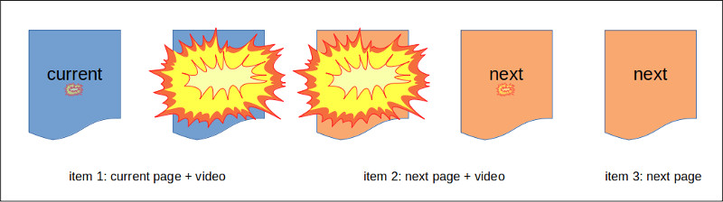

# React-seq  

React-seq is a light-weight library that helps you take full advantage of async functions and generators while
developing React apps. It provides a set of hooks for managing processes that complete over time, such as loading
of code and data. It's designed for React 18 and above.

## Installation

```sh
npm install --save-dev react-seq
```

## Hooks

* [`useSequential`](./doc/useSequential.md) - Returns the last element outputted by an async generator function.
* [`useProgressive`](./doc/useProgressive.md) - Returns an element filled with data from multiple async sources.
* [`useSequentialState`](./doc/useSequentialState.md) - Return the last value outputted by an async generator function.
* [`useProgressiveState`](./doc/useProgressiveState.md) - Return an object whose properties are drawn from async sources.

## Usage scenarios

* [Loading of remote data](#loading-of-remote-data)
* [Page navigation](#page-navigation)
* [Page transition](#page-transition)
* [Authentication](#authentication)
* [State management](#state-management)

## Other topics

* [Error handling](#error-handling)
* [Server-side rendering](#server-side-rendering)
* [Logging](#logging)
* [Unit testing](#unit-testing)
* [ESLint configuration](#eslint-configuration)
* [Jest configuration](#jest-configuration)

## API reference

* [Hooks and other functions](./doc/index.md)
* [Server-side rendering](./doc/server/index.md)
* [Client-side SSR support](./doc/client/index.md)
* [Test utilities](./doc/test-utils/index.md)

## List of examples

* [Payment form](./examples/payment/README.md) <sup>`useSequential`</sup>
* [Star Wars API](./examples/swapi/README.md) <sup>`useProgressive`</sup>
* [Word Press](./examples/wordpress.md) <sup>`useProgressive`</sup>
* [Nobel Prize API](./examples/nobel/README.md) <sup>`useSequentialState`</sup>
* [Star Wars API (alternate implementation)](./examples/swapi-hook/README.md) <sup>`useSequentialState`</sup> <sup>`useProgressiveState`</sup>
* [Word Press (React Native)](./examples/wordpress-react-native.md) <sup>`useProgressive`</sup>
* [Star Wars API (server-side rendering)](./examples/swapi-ssr/README.md) <sup>`useProgressive`</sup>
* [NPM Search](./examples/npm-input/README.md) <sup>`useSequentialState`</sup> <sup>`useProgressiveState`</sup>
* [Media capture](./examples/media-cap/README.md) <sup>`useSequentialState`</sup>
* [Transition](./examples/transition/README.md) <sup>`useSequential`</sup>

## Loading of remote data

Retrieval of data from a remote server is probably the most common async operation in web applications. React-seq
lets you accomplish this task using different approaches. You can use `useSequential` to construct each part of
a page as data arrives:

```js
import { useSequential } from 'react-seq';

function ProductPage({ productId }) {
  return useSequential(async function*({ fallback, defer }) {
    fallback(<div class="spinner"/>);
    defer(200);
    const product = await fetchProduct(productId);
    const { ProductDescription } = await import('./ProductDescription.js');
    yield (
      <div>
        <ProductDescription product={product} />
      </div>
    );
    const related = await fetchRelatedProducts(product);
    const { ProductCarousel } = await import('./ProductCarousel.js');
    yield (
      <div>
        <ProductDescription product={product} />
        <ProductCarousel products={related} />
      </div>
    );
    const promoted = await fetchPromotedProducts();
    const { ProductCarousel } = await import('./ProductCarousel.js');
    yield (
      <div>
        <ProductDescription product={product} />
        <ProductCarousel products={related} />
        <ProductCarousel products={promoted} />
      </div>
    );
    /* ... */
  }, [ productId ]);
}
```

You can periodically update the page with the help of an endless loop:

```js
function ProductPage({ productId }) {
  return useSequential(async function*({ fallback, defer, manageEvents, flush }) {
    fallback(<div class="spinner"/>);
    const [ on, eventual ] = manageEvents();
    for (let i = 0;; i++) {
      defer(i === 0 ? 200 : Infinity);
      try {
        const product = await fetchProduct(productId);
        const { ProductDescription } = await import('./ProductDescription.js');
        yield (
          <div>
            <ProductDescription product={product} onUpdate={on.updateRequest} />
          </div>
        );
        const related = await fetchRelatedProducts(product);
        const { ProductCarousel } = await import('./ProductCarousel.js');
        yield (
          <div>
            <ProductDescription product={product} onUpdate={on.updateRequest} />
            <ProductCarousel products={related} />
          </div>
        );
        const promoted = await fetchPromotedProducts();
        const { ProductCarousel } = await import('./ProductCarousel.js');
        yield (
          <div>
            <ProductDescription product={product} onUpdate={on.updateRequest} />
            <ProductCarousel products={related} />
            <ProductCarousel products={promoted} />
          </div>
        );
      } catch (err) {
        if (i === 0) {
          throw err;
        } else {
          // abandon partially rendered page
          flush(false);
        }
      } finally {
        await eventual.updateRequest.for(5).minutes;
      }
    }
    /* ... */
  }, [ productId ]);
}
```

The example above demonstrates the use of React-seq's [event manager](./doc/managerEvents.md). It's a key component
of the library. Its auto-generated promises and handlers provide the connection between your user interface and
your async code. Here, it allows the user to manually trigger an update: Calling `on.updateRequest` causes the
fulfillment of the `eventual.updateRequest` promise. That releases the generator function from the `await` operation
inside the finally block.

## Page navigation

You can use a `useSequential` hook to handle page navigation for you app in the following manner:

```js
export default function App() {
  const [ parts, query, { trap, throw404, isDetour } ] = useSequentialRouter();
  return useSequential(async function* (methods) {
    const { reject, manageEvents } = methods;
    trap('detour', (err) => {
      reject(err);
      return true;
    });
    const [ on, eventual ] = manageEvents();
    for (;;) {
      try {
        if (parts[0] === 'products') {
          if (parts[1]) {
            const { default: ProductDetails } = await import('./ProductDetails.js');
            yield <ProductDetails id={parts[1]} onReturn={on.return} />;
            await eventual.return;
          } else {
            const { default: ProductList } = await import('./ProductList.js');
            yield <ProductList onSelect={on.selection} />;
            const { selection } = await eventual.selection;
            parts[1] = selection;
          }
        } else if (parts[0] === 'news') {
          if (parts[1]) {
            const { default: Article } = await import('./Article.js');
            yield <Article id={parts[1]} onReturn={on.return} />;
            await eventual.return;
          } else {
            const { default: ArticleList } = await import('./ArticleList.js');
            yield <ArticleList onSelect={on.selection} />;
            const { selection } = await eventual.selection;
            parts[1] = selection;
          }
        } else if (parts[0] === 'notifications') {
          /* ... */
        } else {
          throw404();
        }
      } catch (err) {
        if (isDetour(err)) {
          err.proceed();
        } else {
          yield <ErrorPage error={err} onRetry={on.retry} />;
          await eventual.retry;
        }
      }
    }
  }, [ parts, query, trap, isDetour ]);
}
```

The example above uses [Array-router](https://github.com/chung-leong/array-router), a companion solution designed
to work well with React-seq. It's a minimalist "router" that turns the browser location into an array of path
parts and an object containing query variables. And that is. Actual routing is done using JavaScript control
structures.

## Page transition

React-seq's ability to handle nested async generator tends itself nicely to performing page transition. All we would
need is a function that takes an element and returns a generator producing the right sequence. It can output
anything. The only requirement is that the last item coming from the generator is the next page.

Suppose you want to fill the screen with a fire ball when the user navigates to a different page (because it's a web
site for fans of professional wrestling?). The first item of the transition sequence would be the current page
overlaid with a clip of an explosion. Once the clip has played to some midway point where the screen is fully engulfed
in flame, the generator outputs the next page overlaid with the same clip. Finally, when the clip has reached its end,
the generator outputs only the next page.



Thanks to the syntactic sugar provided by React-seq's event manager, orchestrating such a sequence is quite easy.

To see the concept described here in action, check out the [Transition example](./examples/transition/README.md).

## Authentication

The ability to insert whole sequence of pages anywhere also makes it rather easy to handle authentication. If a
particular section of our app is restricted to logged-in users, all we would have to do is place a line atop the
code for that section:

```js
  yield handleLogin(methods);
```

`handleLogin` might look something like this:

```js
async function* handleLogin({ manageEvents }) {
  if (isAuthenticated()) {
    return;
  }
  const [ on, eventual ] = manageEvents();
  const { ScreenLogin } = await import('./screens/ScreenLogin.js');
  let error;
  for (;;) {
    yield <ScreenLogin onSubmit={on.credentials} lastError={error} />;
    const { credentials } = await eventual.credentials;
    try {
      await authenticateUser(credentials);
      return;
    } catch (err) {
      error = err;
    }
  }
}
```

A call to the function might also happen in the app's catch block, to deal with expired user session:

```js
    } catch (err) {
      if (err instanceof HTTPError && err.status === 401) {
        yield handleLogin(methods);
      } else {
        yield <ScreenError error={err} onRetry={on.retryRequest} />
        await eventual.retryRequest;
      }
    }
  }
```

If the user manages to log in, then our catch block has successfully resolved the error. The loop sends the user back
to where he was before (since the route hasn't changed) and what ever being done there would no longer cause an error.
Everything works as it should.

## State management

State management using an async generator function is generally much easier, even when no inherently async operations
like data retrieval are involved. First of all, you have a variable scope that persists over time. When you need to
remember something, just set a local variable. At the same time the number of states of you need to maintain is
sharply reduced, thanks to async functions' ability to halt mid-execution. Consider the
[the following example](./examples/konami-code/README.md). It's a hook that listens for a sequence of keystrokes
matching the well-known [Konami code](https://en.wikipedia.org/wiki/Konami_Code):

```js
function useKonamiCode() {
  return useSequentialState(async function*({ initial, mount, manageEvents, signal }) {
    initial(false);
    await mount();
    const [ on, eventual ] = manageEvents();
    window.addEventListener('keydown', on.key.filter(e => e.key), { signal });
    while (!(
         await eventual.key.value() === 'ArrowUp'
      && await eventual.key.value() === 'ArrowUp'
      && await eventual.key.value() === 'ArrowDown'
      && await eventual.key.value() === 'ArrowDown'
      && await eventual.key.value() === 'ArrowLeft'
      && await eventual.key.value() === 'ArrowRight'
      && await eventual.key.value() === 'ArrowLeft'
      && await eventual.key.value() === 'ArrowRight'
      && await eventual.key.value() === 'b'
      && await eventual.key.value() === 'a'
    ));
    yield true;
  }, []);
}
```

Notice how there isn't an array holding the keys that the user has pressed. No number indicating which portion of
the sequence has matched thus far either. There are no progress-tracking variables. We don't need them because the
JavaScript engine is tracking progress for us. It knows where in the code it has stopped.

Note also the use of [`signal`](./doc/signal.md) in the call to
[`addEventListener`](https://developer.mozilla.org/en-US/docs/Web/API/EventTarget/addEventListener). That eliminates
the need to call `removeEventListener`.

For further demonstration of how React-seq can help you manage state, please consult the
[media capture example](./examples/media-cap/README.md).

## Error handling

Errors encountered by React-seq hooks will trigger component updates and get rethrown during React's rendering cycle,
allowing them to be handled by an error boundary further up the component tree.

When you employ the Yield-Await-Promise model, you can funnel errors through the generator tree with the help of
[`reject`](./reject.md). Example:

```js
function App() {
  return useSequential(async function*(methods) {
    const { manageEvents, wrap, reject } = methods;
    const [ on, eventual ] = manageEvents();
    // create error boundary around contents
    wrap(children => <ErrorBoundary onError={reject}>{children}</ErrorBoundary>);
    wrap(children => <AppFrame>{children}</AppFrame>);
    let section = 'news';
    for (;;) {
      try {
        if (section === 'news') {
          // handle news section in a separate function
          yield handleNewsSection({ methods });
        } else if (page === 'products') {
          /* ... */
        }
      } catch (err) {
        yield <ErrorPage error={err} />;
      }
    }
  }, []);
}

async function *handleNewsSection({ wrap, manageEvents }) {
  const [ on, eventual ] = manageEvents();
  const unwrap = wrap(children => <NewsSection>{children}</NewsSection>);
  let articleId;
  try {
    for (;;) {
      try {
        if (articleId) {
          /* ... */
        } else {
          try {
            yield <ArticleList onSelect={on.selection} />;
            // wait for an article to be selected
            articleId = await eventual.selection.value();
          } catch (err) {
            // handle errors from ArticleList
          }
        }
      } catch (err) {
        if (err instanceof CMSError) {
          // handle error specific to section
        } else {
          throw err;
        }
      }
    }
  } finally {
    unwrap();
  }
}

function ArticleList() {
  return useProgressive(async ({ type, usable, manageEvents, signal }) => {
    type(ArticleListUI);
    usable({ articles: 1 });
    const [ on, eventual ] = manageEvents();
    const options = { signal };
    const articles = fetchAll(() => eventual.needForMore, options);
    const authors = fetchAuthors(articles, options);
    const categories = fetchCategories(articles, options);
    const tags = fetchTags(articles, options);
    const media = fetchFeaturedMedia(articles, options);
    return { articles, authors, categories, tags, media, onBottomReached: on.needForMore };
  }, []);
}

class ErrorBoundary extends Component {
  constructor(props) {
    super(props);
    this.state = { error: null, fresh: false };
  }

  static getDerivedStateFromProps(props, state) {
    const { error, fresh } = state;
    if (fresh) {
      // render() needs to see this--clear it next time
      return { error, fresh: false };
    } else {
      // clear stale error
      return { error: null };
    }
  }

  static getDerivedStateFromError(error) {
    return { error, fresh: true };
  }

  render() {
    let { error } = this.state;
    if (error) {
      // keep rendering if the error was patched up somehow
      if (this.props.onError(error) === true) {
        error = null;
      }
    }
    return !error ? this.props.children : null;
  }
}
```


## Server-side rendering

React-seq has built-in support for a simple kind of server-side rendering (SSR), where server-generated HTML
is basically used as an app's fallback screen. Only a single function call is needed:

```js
  fastify.get('/*', async (req, reply) => {
    reply.type('text/html');
    const location = `${req.protocol}://${req.hostname}/${req.params['*']}`;
    return renderInChildProc(location, buildPath);
  });
```

[`renderInChildProc`](./doc/server/renderInChildProc.md) will generate the page using the app's production build.
You don't need to make any change to your project's configuration. You only need to enable
[hydration](./doc/client/hydrateRoot.md) and [render-to-server](./doc/client/renderToServer.md) in your app's
boot-strap code:

```js
import App from './App.js';
import { hydrateRoot, renderToServer } from 'react-seq/client';

if (typeof(window) === 'object') {
  hydrateRoot(document.getElementById('root'), <App />);
} else {
  renderToServer(<App />);
}
```

To see SSR in action, clone the repository and run the [Star Wars API SSR example](./examples/swapi-ssr/README.md).

## Logging

The library provides a mean for you to examine what happens inside its hooks. When a hook detects the presence of
an [`InspectorContext`](./doc/InspectorContext.md), it will start reporting events to the given inspector
instance.

React-seq comes with two built-in inspectors: [`ConsoleLogger`](./doc/ConsoleLogger.md) and
[`PromiseLogger`](./doc/PromiseLogger.md). You can create you own by extending [`Inspector`](./doc/Inspector.md).


The [Payment form example](./examples/payment/README.md#logging) makes use of `ConsoleLogger`:

```js
export default function App() {
  const logger = useMemo(() => new ConsoleLogger(), []);
  return (
    <div className="App">
      <header className="App-header">
        <p>Payment Page Example</p>
      </header>
      <InspectorContext.Provider value={logger}>
        <PaymentPage />
      </InspectorContext.Provider>
    </div>
  );
}
```

## Unit testing

For the purpose of unit testing React-seq provides two functions:
[`withTestRenderer`](./doc/test-utils/withTestRenderer.md) and [`withRestDOM`](./doc/test-utils/withRestDOM.md).
One utilizes [React Test Renderer](https://reactjs.org/docs/test-renderer.html) while the other relies on the
presence of the DOM. They have the same interface.

The following is a test case from the [Payment form example](./examples/payment/README.md#unit-testing):

```js
import { withTestRenderer } from 'react-seq/test-utils';
import { PaymentPage } from './PaymentPage.js';
import { PaymentSelectionScreen } from './PaymentSelectionScreen.js';
import { PaymentMethodBLIK } from './PaymentMethodBLIK.js';
import { PaymentProcessingScreen } from './PaymentProcessingScreen.js';
import { PaymentCompleteScreen } from './PaymentCompleteScreen.js';

test('payment with BLIK', async () => {
  await withTestRenderer(<PaymentPage />, async ({ awaiting, showing, shown, resolve }) => {
    expect(showing()).toBe(PaymentSelectionScreen);
    expect(awaiting()).toBe('selection');
    await resolve({ selection: { name: 'BLIK', description: 'Payment using BLIK' } });
    expect(showing()).toBe(PaymentMethodBLIK);
    expect(awaiting()).toBe('submission.or.cancellation');
    await resolve({ submission: { number: '123 456' } });
    expect(shown()).toContain(PaymentProcessingScreen);
    expect(showing()).toBe(PaymentCompleteScreen);
    expect(awaiting()).toBe(undefined);
  });
});
```

`withTestRenderer` renders the component and awaits the first stoppage point. A stoppage point is either the
termination of a hook's generator or an `await` on a promise of the event manager. When one of the two occurs,
the callback is invoked. The test code can then check whether the expected outcome has been achieved then force
the component to move to the next stoppage point by manually settling the awaited promise.

## ESLint configuration

Add "react-seq" to your ESLint settings to enable the linting of React-seq hooks:

```json
  "eslintConfig": {
    "extends": [
      "react-app",
      "react-app/jest",
      "react-seq"
    ]
  },
```

You will find the `eslintConfig` section in your project's `package.json` if it was created using **Create React App**.

## Jest configuration

Add the following to your project's `package.json` so Jest would transpile the library:

```json
  "jest": {
    "transformIgnorePatterns": [
      "!node_modules/react-seq/"
    ]
  },
```
