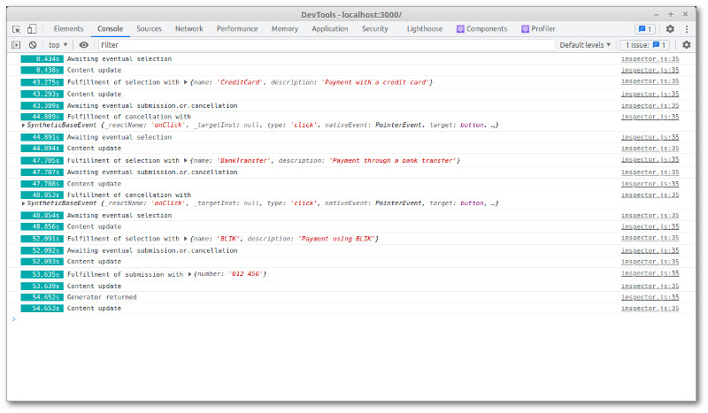

# ConsoleLogger

[Inspector](./Inspector.md) that outputs events to the development console



## Syntax

```js
function Widget() {
  const [ logging, toggle ] = useReducer(t => !t, false);
  const logger = useMemo(() => logging ? new ConsoleLogger() : null, [ logging ]);
  return (
    <div>
      <InspectorContext.Provider value={logger}>
        <AnotherWidget />
      </InspectorContext.Provider>
      <button onClick={toggle}>Toggle Logging</button>
    </div>
  );
}
```
