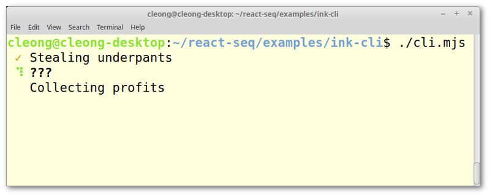

# Ink CLI Example

On prior occasions I've mentioned how React-seq lets you employ imperative programming, a model used 
often for text-based, CLI programs. In this example, we're going to create an actual CLI program. 
We'll make use of [Ink](https://github.com/vadimdemedes/ink), a React renderer that targets the terminal. 
Since CLI programs often involves time-consuming operations, React-seq complements Ink rather nicely.

## Seeing the code in action

Go to the `examples/ink-cli` folder. Run `npm install` then `npm start`. 


You can skip the transpilation step and run the script directly:



## Working with JSX

Since Node.js cannot run code containing JSX, this example comes with a [script](./transpile.mjs) that 
transpiles all .jsx files in the working folder to .mjs. It was written in anticipation of being 
reused. It is capable of handling dynamic import (with non-static path as well), something not done in 
this example. Feel free to make use of it in your own project.

## Boostrap code

[`cli.jsx`](./cli.jsx) is the program's entry point. As you can see, it starts with a shebang. The 
bootstrap sequence is pretty simple:

```js
#!/usr/bin/env node
import { useSequential } from 'react-seq';
import { render } from 'ink';
import main from './main.jsx';

function App() {
  return useSequential(main, []);
}

render(<App />);
```

The `App` component is as barebone as can be. All it does is return what 
[`useSequential`](../../doc/useSequential.md) returns. The real action takes place inside the main 
function.

## The main function

[`main.jsx`](./main.jsx) is where the bulk of the program's code is expected to reside:

```js
export default async function* main({ fallback }) {
  fallback(<Text />);
  let phase = 1;
  yield <BusinessPlan phase={phase} />;
  await stealUnderpants();
  phase++;
  yield <BusinessPlan phase={phase} />;
  await _?.();
  phase++;
  yield <BusinessPlan phase={phase} />;
  await collectProfits();
  phase++;
  yield <BusinessPlan phase={phase} />;
}
```

We're just pretending to be busy here. Nothing is actually happening. No one will lose their 
underpants as a result of you running this demo. In a real program the functions would do 
actual work like downloading a file or unpacking a tarball. But you get the idea.

Note the use of [`fallback`](../../fallback.md). Ink does not like `<Suspense>` without a 
fallback for some reason. An error would occur if we don't give it that empty text block. A
real-life program that performs lengthy initiation might actually use `fallback` to indicate 
that it's starting up.

## UI components

Our UI simply contains a list of tasks that need to be done:

```js
function BusinessPlan({ phase }) {
  return (
    <>
      <Phase number={1} current={phase}>Stealing underpants</Phase>
      <Phase number={2} current={phase}>???</Phase>
      <Phase number={3} current={phase}>Collecting profits</Phase>
    </>
  );
}

function Phase({ number, current, children }) {
  let status, bold = false;
  if (current === number) {
    status = <Text color="green"><Spinner /></Text>;
    bold = true;
  } else if (current > number) {
    status = <Text color="yellow">{'\u2713'}</Text>;
  } else {
    status = <Text> </Text>;
  }
  return <Text bold={bold}> {status} {children}</Text>;
}
```

A spinner will appear in front of the current task. Tasks already completed are noted by check 
marks. Upcoming tasks are given a space to, well, take up the space.

## Final thoughts

Well, that's it! That wasn't so hard, right? Creating an attractive, professionally-looking 
UI for your CLI program doesn't require that much added effort compared to doing a bunch of 
calls to `console.log`. Your end users will certainly appreciate it.

Be sure to read through the [documentation of Ink](https://github.com/vadimdemedes/ink) if 
you are not already familiar with it. It's a very powerful framework for CLI development. 
This  example has barely scratched the surface. There're numerous components for handling 
user input, like text input and drop-down. With the help of React-seq, making use of them is 
fairly straight forward. Trying to build a sensible input scheme using `readline` would 
certainly be way harder.

Thanks for reading! As always, if you have any question, feel free to ask on the 
[discussion board](https://github.com/chung-leong/react-seq/discussions). Please give the 
project a star if you think it's a worthwhile effort.