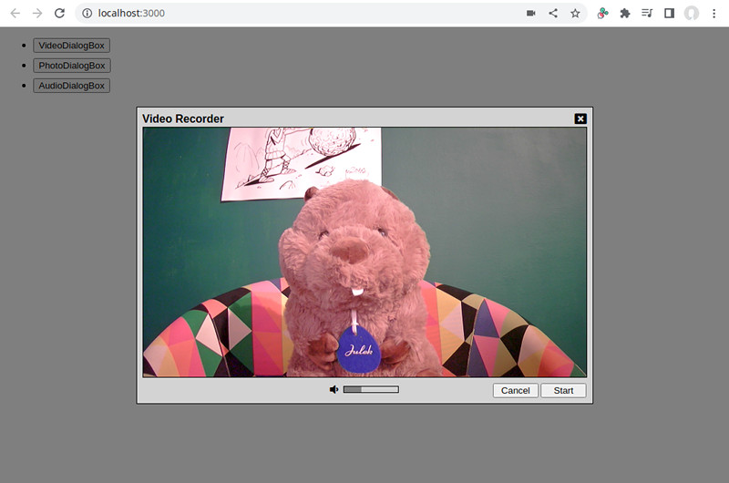
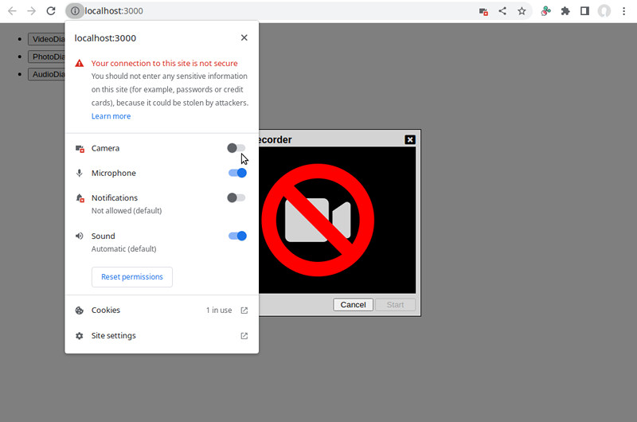

# Media Capture Example

In this example, we're going to create a React hook that allows a component to capture image, video, or audio. We'll
utilize the [`useSequentialState`](../../doc/useSequentialState.md) hook to help us manage the different stages of
the capturing process.

## Seeing the code in action

Go to the `examples/media-cap` folder. Run `npm install` then `npm start`. A browser window should automatically
open up.



Click on one of the buttons to open up a dialog box that captures a specific type of media.

To see the final file sizes (after gzip), run `npm run build` then `npm run analyze`.

## The hook consumer

First, let us take a quick look at the [`VideoDialogBox`](./src/VideoDialogBox.js) component:

```js
export default function VideoDialogBox({ onClose, onCapture }) {
  const {
    status,
    liveVideo,
    capturedVideo,
    devices,
    duration,
    volume,
    selectedDeviceId,
    lastError,

    record,
    pause,
    resume,
    stop,
    clear,
    selectDevice,
  } = useMediaCapture({ watchVolume: true });
```

The first thing it does is call the [`useMediaCapture`](./src/media-cap.js) hook, specifying that it wants the
mic volume monitored. From the hook it receives a number of state variables (top half) and also functions to
call (bottom half).

Going [further down](.//src/VideoDialogBox.js#L55), within the return statement we seeing the following IIFE:

```js
{(() => {
  switch(status) {
    case 'acquiring':
      return (
        <span className="fa-stack fa-lg">
          <i className="fa fa-video fa-stack-1x" />
        </span>
      );
    case 'denied':
      return (
        <span className="fa-stack fa-lg">
          <i className="fa fa-video fa-stack-1x" />
          <i className="fa fa-ban fa-stack-2x" />
        </span>
      );
    case 'previewing':
    case 'recording':
    case 'paused':
      return <StreamVideo srcObject={liveVideo.stream} style={size} muted />;
    case 'recorded':
      return <BlobVideo srcObject={capturedVideo.blob} style={size} controls />;
    default:
  }
})()}
```

This is the main content of the dialog box. At the "acquiring" stage, when the browser is asking the user for
permission to use the camera, we simply show an icon. If the user said no, we put a ban icon over it. At the
"previewing" stage, when we have a live video stream, we render a [`StreamVideo`](./src/StreamVideo.js) component,
which simply returns a `<video>` element and attaches the stream. The live video remains through the "recording" and
"paused" stages. When we've reached the "recorded" stage, we render a [`BlobVideo`](./src/BlobVideo.js), another
simple component.

## The hook

Let us move on and start examining [the hook itself](./src/media-cap.js):

```js
export function useMediaCapture(options = {}) {
  const {
    video = true,
    audio = true,
    preferredDevice = 'front',
    selectNewDevice = true,
    watchVolume = false,
  } = options;
  return useSequentialState(async function*({ initial, mount, manageEvents }) {
    let status = 'acquiring';
    let duration;
    let volume;
    let liveVideo;
    let liveAudio;
    let capturedVideo;
    let capturedAudio;
    let capturedImage;
    let lastError;
    let devices = [];
    let selectedDeviceId;
```

It starts out by extracting some option variables from the object given. Then it immediately calls
[`useSequentialState`](../../doc/useSequentialState.md). The async generator function is where most of the action
happens.

We make use of three functions provided by `useSequentialState`: `initial` to set the hook's initial state, `mount`
to run code during the `useEffect` phase of the component lifecycle, and `manageEvents` to manage events with the
help of promises.

The generator function begins by declaring variables that will get sent to the hook consumer. [Further down](./src/media-cap.js#L24), we see the functions that the hook consumer can call:

```js
    const [ on, eventual ] = manageEvents({});

    function snap(mimeType, quality) {
      on.userRequest({ type: 'snap', mimeType, quality });
    }

    function record(options, segment = undefined, callback = null) {
      on.userRequest({ type: 'record', options, segment, callback });
    }

    function pause() {
      on.userRequest({ type: 'pause' });
    }

    function stop() {
      on.userRequest({ type: 'stop' });
    }

    function resume() {
      on.userRequest({ type: 'resume' });
    }

    function clear() {
      on.userRequest({ type: 'clear' });
    }

    function selectDevice(deviceId) {
      on.userRequest({ type: 'select', deviceId });
    }
```

As you can see, each of them will fulfill the [`eventual.userRequest`](../../doc/manageEvents.md) promise.

We see next the function that will package our local variables into an object, to be delivered to the hook consumer:

```js
    function currentState() {
      return {
        status,
        duration,
        volume,
        liveVideo,
        liveAudio,
        capturedVideo,
        capturedAudio,
        capturedImage,
        lastError,
        devices,
        selectedDeviceId,

        snap,
        record,
        pause,
        stop,
        resume,
        clear,
        selectDevice,
      };
    }
```

The function is first invoked on [line 83](./src/media-cap.js#L83) to set the initial state:

```js
    initial(currentState());
```

What follow are functions that deal with the nitty-gritty of the capturing process. We'll skip over these and head to
[line 289](./src/media-cap.js#L289) where [`mount`](../../doc/mount.md) is called:

```js
  await mount();
```

The function returns a promise that is fulfilled by the mounting of the component. In other words, when React
invokes its `useEffect` hooks. We need to wait for this to happen whenever our code makes changes that need to
eventually be reverted, for instance, attachment of event handlers to the DOM. Mounting means eventual unmounting,
guaranteeing the triggering of the component's abort controller and the execution of its finally section.

To see what would happen otherwise, try commenting out the line. This example runs under
[Strict Mode](https://reactjs.org/docs/strict-mode.html), which means during development React will call our
component function twice. Two async generators will be created as a result. Only one of them will witness a mount. With
the checkpoint in place, our code functions correctly. The second, spurious generator gets stopped in its track.
Without it, the spurious generator continues onward, eventually acquiring for itself a feed from the camera (which
you cannot see). When you close the video capture window then, you'll notice that your camera will remain active. The
first generator has shut its feed down but the second generator is still holding onto its.

After establishing the checkpoint, we proceed to attach event listeners to various parts of the browser:

```js
// set up event listeners
window.addEventListener('orientationchange', (evt) => {
  // wait for resize event to occur
  window.addEventListener('resize', async () => {
    if (liveVideo) {
      const el = await createVideoElement(stream);
      if (el.videoWidth !== liveVideo.width || el.videoHeight !== liveVideo.height) {
        liveVideo = { stream, width: el.videoWidth, height: el.videoHeight };
        on.streamChange({ type: 'streamchange' });
      }
    }
  }, { once: true });
}, { signal });
navigator.mediaDevices.addEventListener('devicechange', on.deviceChange, { signal });

// watch for permission change
for (const name of [ 'camera', 'microphone' ]) {
  const status = await navigator.permissions.query({ name });
  status.addEventListener('change', on.permissionChange, { signal });
}
```

As you can see, there are quite a number of relevant events. The device can get rotated, thereby changing the
dimensions of the video feed. A device can be plugged in or get unplugged. Permission levels can be toggled. All of
these events will cause different `eventual` promises to be fulfilled.

After this, the generator enters an infinite loop inside a try-finally block, with a try-catch block inside it:

```js
    try {
      for (;;) {
        try {
```

Let us first examine the finally and catch blocks ([line 399](./src/media-cap.js#L399)) near the function's bottom:

```js
        } catch (err) {
          lastError = err;
          if (status === 'acquiring') {
            status = 'denied';
          }
        }
        yield currentState();
      } // end of for loop
    } finally {
      mediaRecorder?.stop();
      closeStream();
    }
```

The finally block is quite simple. It's there to perform final clean up. If a recorder is active, it's shutdown. If
a media stream is open, it gets closed. We don't need to use `removeEventListener` here to remove the listeners we
had installed earlier--our abort controller will do this for us.

The catch block is also quite simple. It saves just the error to `lastError`. If we're in the middle of acquiring a
device, it changes the status to "denied".

Below the catch block is the generator's one and only `yield` statement. Every time we go through the `for` loop,
the hook consumer will receive a new state, consisting of the local variables declared at the beginning of the
generator function. The UI will get updated to reflect the changes that have occurred.

Now, let us look at what our event loop does in each of the possible statuses.

## Status: "acquiring" ([line 315](./src/media-cap.js#L315))

```js
          if (status === 'acquiring') {
            // acquire a media-capturing device
            await openStream();
            status = 'previewing';
          } else ...
```

We try opening a media stream. If the operation succeeds, the status is changed to "previewing". If not, we end up in
the catch block, described above.

## Status: "previewing" ([line 319](./src/media-cap.js#L319))

```js
          } else if (status === 'previewing') {
            const evt = await eventual.userRequest.or.streamChange.or.deviceChange.or.volumeChange;
            if (evt.type === 'record') {
              await startRecorder(evt.options, evt.segment, evt.callback);
              status = 'recording';
            } else if (evt.type === 'snap') {
              await createSnapShot(evt.mimeType, evt.quality);
              status = 'recorded';
            } else if (evt.type === 'select') {
              closeStream();
              selectedDeviceId = evt.deviceId;
              status = 'acquiring';
            } else if (evt.type === 'streamend') {
              closeStream();
              status = 'acquiring';
            } else if (evt.type === 'devicechange') {
              const prev = devices;
              await getDevices();
              if (selectNewDevice) {
                const newDevice = devices.find(d1 => !prev.find(d2 => d2.id === d1.id));
                if (newDevice) {
                  closeStream();
                  selectedDeviceId = newDevice.id;
                  status = 'acquiring';
                }
              }
            }
          } else ...
```

The user is now seeing the output from his camera. At this point, he might:

* Click a button in the dialog box (fulfilling `eventual.userRequest`)
* Select a different device using a dropdown (also fulfilling `eventual.userRequest`)
* Rotate the camera (fulfilling `eventual.streamChange`)
* Unplug the camera (also fulfilling `eventual.streamChange`)
* Plug in a different camera (fulfilling `eventual.deviceChange`)
* Speak into the microphone (fulfilling `eventual.volumeChange`)

We explicitly anticipate all these possibilities in our `await` statement. (If the statement looks strange to you,
please consult the documentation of [`manageEvents`](../../doc/manageEvents.md).)

If the user clicks the Start button, we start the recorder then change the status to "recording".

If the user clicks the Take button (in [`PhotoDialogBox`](./src/PhotoDialogBox.js)), we create a snapshot then change
the status to "recorded".

If the user chooses a different camera, we close the current stream, save the device id, and go back to "acquiring".

If the user unplugs the camera, we do the same thing in hope of finding another camera.

If the user plugs in a new camera, we choose it as the active device since using that camera is very likely the
user's intention.

If the volume level is different, we don't need to do anything, as the variable `volume` has already been updated. The
yield statement at the bottom of the loop will deliver the new value to the hook consumer, which will adjust the
volume bar accordingly.

## Status: "recording" ([line 346](./src/media-cap.js#L346))

```js
          } else if (status === 'recording') {
            const evt = await eventual.userRequest.or.streamChange.or.durationChange.or.volumeChange;
            if (evt.type === 'stop') {
              const recorded = await stopRecorder();
              status = (recorded) ? 'recorded' : 'previewing';
            } else if (evt.type === 'pause') {
              mediaRecorder.pause();
              status = 'paused';
            } else if (evt.type === 'streamend') {
              closeStream();
              const recorded = await stopRecorder();
              status = (recorded) ? 'recorded' : 'acquiring';
            }
          } else ...
```

The video recorder has been switched on. What can happen at this stage? Well, the same things as before plus
continual changes to the video duration. As the user has committed to using the current camera, we elect to ignore
device change events here.

If the user clicks the Stop button we stop the recorder. Depending on whether anything has been recorded, we set
the status to either "recorded" or "previewing".

We respond the same the same way if the user unplugs the camera, except we go back to "acquiring" when there is
nothing recorded.

Fulfillment of `durationChange` or `volumeChange` does not require any additional action. The code just needs to
"wake up" so the `yield` statement gets run.

## Status: "paused" ([line 359](./src/media-cap.js#L359))

```js
          } else if (status === 'paused') {
            const evt = await eventual.userRequest.or.streamChange.or.volumeChange;
            if (evt.type === 'stop') {
              const recorded = await stopRecorder()
              status = (recorded) ? 'recorded' : 'previewing';
            } else if (evt.type === 'resume') {
              mediaRecorder.resume();
              status = 'recording';
            } else if (evt.type === 'streamend') {
              closeStream();
              const recorded = await stopRecorder();
              status = (recorded) ? 'recorded' : 'acquiring';
            }
          } else ...
```

The code for the "paused" stage is nearly identical to that of the "recording" stage. The only difference is here the
user can resume recording and we're not anticipating changes in the video duration.

## Status: "recorded" ([line 372](./src/media-cap.js#L372))

```js
          } else if (status === 'recorded') {
            unwatchAudioVolume();
            const evt = await eventual.userRequest.or.streamChange;
            if (evt.type === 'clear') {
              capturedVideo = undefined;
              capturedAudio = undefined;
              capturedImage = undefined;
              status = (stream) ? 'previewing' : 'acquiring';
              if (stream) {
                watchAudioVolume();
                // refresh the list just in case something was plugged in
                await getDevices();
              }
            } else if (evt.type === 'streamend') {
              closeStream();
            }
          } else ...
```

Okay, we have recorded something. The first thing we do is turn off volume monitoring, as showing the input
from the mic doesn't make sense while the user is playing back the clip. At this stage, we're waiting for the user
to either accept the result, which would result in the component being unmounted and a shutdown of the generator, or
request a do-over. In the latter case, we clear the `captured___` variables, reenable volume monitoring, and set the
status to "previewing" once again--provided we still have the live stream. The user could potentially have unplugged
the camera while reviewing the video, requiring a trip to the "acquiring" stage. We also need to rescan the list
of available devices, as we have been ignoring `eventual.deviceChange` in the prior stages.

## Status: "denied" ([line 388](./src/media-cap.js#L388))

```js
          } else if (status === 'denied') {
            const evt = await eventual.deviceChange.or.permissionChange;
            if (evt.type === 'devicechange') {
              await getDevices();
              if (devices.length > 0) {
                status = 'acquiring';
              }
            } else if (evt.type === 'change') {
              status = 'acquiring';
            }
          }
```

Finally, we only have the "denied" status to consider. What can happen at this stage that can get us out of it?
Well, the user plugging in a camera could potentially give us access to one. The user flipping the switch
in the browser's permission panel might also do the trick:



So we do an `await eventual.deviceChange.or.permissionChange`. When one of these two things happen, we go back to the
"acquiring" stage and try again.

## Groundhog Day?

Whew, that's it! After looking through the code, you might be wondering, "How exactly do we exit from the for loop?"
There's no `break` or `return` anywhere and the catch block is swallowing all errors. There's no way out, it seems.

You can find the answer to that question in the [documentation of
`AsyncGenerator`](https://developer.mozilla.org/en-US/docs/Web/JavaScript/Reference/Global_Objects/AsyncGenerator/return):

> The return() method of an async generator acts as if a return statement is inserted in the generator's body at the
> current suspended position, which finishes the generator and allows the generator to perform any cleanup tasks when
> combined with a try...finally block.

Another thing that you might wonder about is the fate of the second generator, the one created due to strict mode.
What happens when a piece of async code gets permanently stuck, waiting for a promise that would never get fulfilled?
The answer is...it's pining for the fjords. Stone dead, in another word. There are no more external references to
any part of the generator after it has reached the `await` statement. All associated objects therefore become
eligible for garbage collection. The generator effectively is no longer there.

## Final Thoughts

I hope this example helped you gain some insight into what can be done with async generator and React-seq. Async
generator is a very powerful addition to JavaScript. It's definitely far more useful than being just an array that
you create dynamically. This example has nothing to do with arrays. We're using async generators to help us
make a complex process with many moving parts more manageable, more understandable. I hope you managed to follow the
code without difficulties. If there's anything unclear, please feel free to contact me or make use of the discussion
board.
