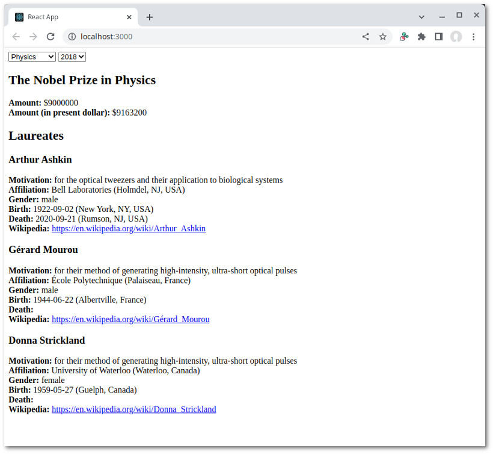

# Nobel Prize API example

This example demonstrates the use of [`useSequentialState`](../../doc/useSequentialState.md#readme) in creating a custom
data hook. Unlike [`useSequential`](../../doc/useSequential.md#readme) which returns an element and is tied into React's
suspension mechanism, `useSequentialState` just gives you what comes out of an async generator. It's more agnostic
in a sense and can be employed in more situations. Basically, any time when your component needs some remote data
set that requires multiple requests to retrieve.

The data source for this example is the [Nobel Prize API](https://www.nobelprize.org/about/developer-zone-2/). As
the name implies, it provides information about Nobel prizes and laureates.

## Seeing the code in action

Go to the `examples/nobel` folder. Run `npm install` then `npm start`. A browser window should automatically
open up.



## The app

The [example app](./src/App.js) is completely bare bone: just a pair of drop-downs for selecting the category
and year:

```js
function App() {
  const [ year, setYear ] = useState('');
  const [ category, setCategory ] = useState('');
  const prize = useNobelPrize(category, year);
  return (
    <div className="App">
      <div className="toolbar">
        <select onChange={evt => setCategory(evt.target.value)} value={category} required>
          <option value="">Category</option>
          {categories.map(({ code, name }) => <option key={code} value={code}>{name}</option>)}
        </select>
        {' '}
        <select onChange={evt => setYear(evt.target.value)} value={year} required>
          <option value="">Year</option>
          {years.map(year => <option key={year} value={year}>{year}</option>)}
        </select>
      </div>
      {prize && <Prize {...prize} />}
    </div>
  );
}
```

`useNobelPrize` is our custom hook. It returns an object containing information about the prize awarded
in the given category and year--or `undefined` when it hasn't yet retrieved anything.

## The hook

[Our hook](./src/nobel.js) fetches data in two stages. First, information about the prize itself is retrieved:

```js
export function useNobelPrize(category, year) {
  return useSequentialState(async function*({ defer, signal }) {
    if (!category || !year) {
      return;
    }
    const prizeURL = new URL(`https://api.nobelprize.org/2.1/nobelPrize/${category}/${year}`);
    const [ {
      categoryFullName,
      prizeAmount,
      prizeAmountAdjusted,
      laureates
    } ] = await fetchJSON(prizeURL, { signal });
    let prize = {
      fullName: str(categoryFullName),
      amount: prizeAmount,
      amountAdjusted: prizeAmountAdjusted,
      laureates: laureates?.map(({ fullName, orgName, motivation }) => {
        return {
          fullName: str(fullName) ?? str(orgName),
          motivation: str(motivation),
        };
      }),
    };
    yield prize;
    /* ... */
```

The prize endpoint only gives us the names of the laureates and the reason why they were awarded the prize. After
yielding this initial information, we proceed to obtain additional information about each laureate from the
laureate endpoint:

```js
    /* ... */
    if (laureates) {
      for (const [ index, laureate ] of laureates.entries()) {
        const [ {
          gender,
          birth,
          death,
          nobelPrizes,
          wikipedia,
        } ] = await fetchJSON(laureate.links.href);
        prize = { ...prize };
        const target = prize.laureates[index];
        target.gender = gender;
        target.birth = formatDatePlace(birth);
        target.death = formatDatePlace(death);
        // find the relevant prize
        const matchingPrize = nobelPrizes.find(p => p.awardYear === year);
        target.affiliation = formatAffiliation(matchingPrize?.affiliations?.[0]);
        target.wikipedia = wikipedia.english;
        yield prize;
      }
    }
  }, [ category, year ]);
}
```

Note how we need to clone the object to ensure that React will recognize it as a new state.

## Omitting event manager

Well, that's it. One additional piece of information I would like to add is how to omit code of the event manager.
All you need to do is set the environment variable `REACT_APP_SEQ_NO_EM` to non-zero when building:

```json
    "build": "REACT_APP_SEQ_NO_EM=1 react-scripts build",
```

This will save you 2K, reducing the footprint of React-seq to about 3K (gzipped).

## Final thoughts

Dealing with asynchronous operations in React can be a little tricky. React-seq helps you manage the process using
a standard part of JavaScript: the async generator. I hope you'll consider using it in one of your projects. If
you have any question or suggestion, feel free to contact me or make use of the [discussion
board](https://github.com/chung-leong/react-seq/discussions).
