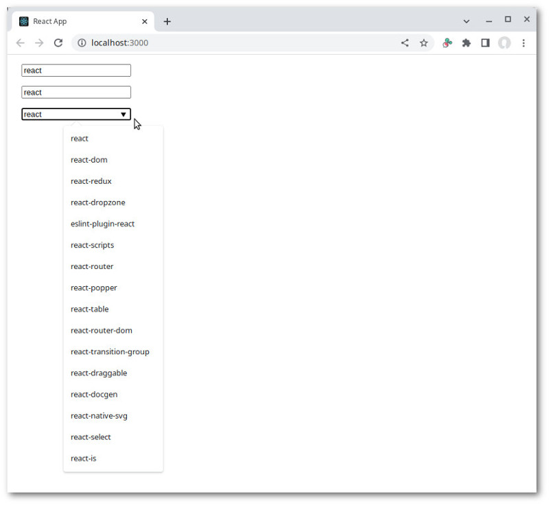
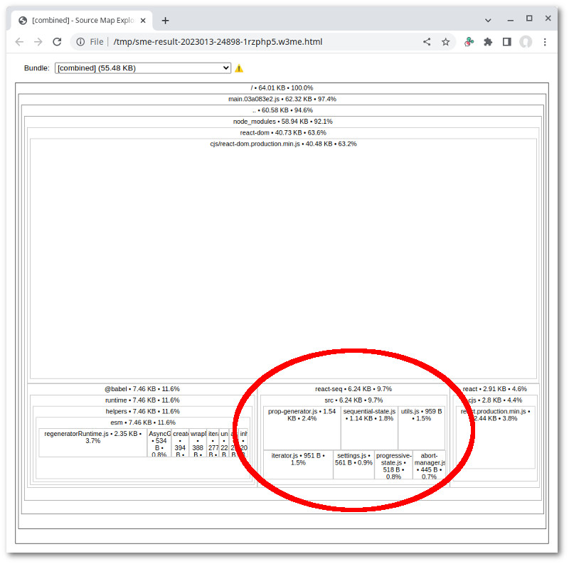

# NPM data list example

In this example, we're going to examine a marginal usage scenario. React-seq is designed for situations
where you have a long sequence of operations. What if you have a sequence of one? Is it still worthwhile to use
React-seq when all you need to do is fetching a single JSON?

What we're going to do is build a hook using just standard hooks provided by React. Then we're going to create
alternative implementations with the help of React-seq. The exercise should give us some useful insights.

## Seeing the code in action

Go to the `examples/npm-input` folder. Run `npm install` then `npm start`. A browser window should automatically
open up.



## App component

The [example app](./src/App.js) just creates three input boxes, each attached to a [datalist
element](https://developer.mozilla.org/en-US/docs/Web/HTML/Element/datalist). When you enter text into one of the
input boxes, a search is perform at the NPM package registry and the corresponding datalist is updated:

```js
export default function App() {
  const [ search1, setSearch1 ] = useState('');
  const [ search2, setSearch2 ] = useState('');
  const [ search3, setSearch3 ] = useState('');
  const onChange1 = useCallback(evt => setSearch1(evt.target.value), []);
  const onChange2 = useCallback(evt => setSearch2(evt.target.value), []);
  const onChange3 = useCallback(evt => setSearch3(evt.target.value), []);
  const list1 = useNPMList1(search1);
  const list2 = useNPMList2(search2);
  const list3 = useNPMList3(search3);

  function createList(id, items) {
    return (
      <datalist id={id}>
        {items.map((v, i) => <option key={i} value={v} />)}
      </datalist>
    );
  }

  return (
    <div className="App">
      <div>
        <input list="list1" value={search1} onChange={onChange1} />
        {createList('list1', list1)}
      </div>
      <div>
        <input list="list2" value={search2} onChange={onChange2} />
        {createList('list2', list2)}
      </div>
      <div>
        <input list="list3" value={search3} onChange={onChange3} />
        {createList('list3', list3)}
      </div>
    </div>
  );
}
```

## React-only hook

Our [React-only hook](./src/App.js#L42) performs the search in a `useEffect` hook:

```js
function useNPMList1(search) {
  const searchDeferred = useDeferredValue(search.trim());
  const [ list, setList ] = useState([]);
  useEffect(() => {
    const controller = new AbortController();
    const { signal } = controller;
    fetchPackages(searchDeferred, { signal }).then((list) => {
      if (!signal.aborted) {
        startTransition(() => setList(list));
      }
    });
    return () => {
      controller.abort();
      setList([]);
    };
  }, [ searchDeferred ]);
  return list;
}
```

An [`AbortController`](https://developer.mozilla.org/en-US/docs/Web/API/AbortController) is used to terminate the
fetch request when new user input makes it obsolete. Note the check on `signal.aborted`. It's necessary due to
`fetchPackages` capturing all errors.

Implementing our hook using straight React is not particularly difficult. On the other hand, it's also not very
intuitive. Special care needs to be taken to keep abandoned async operations from making unforeseen state changes.

## Hook using useSequentialState

With the help of [`useSequentialState`](../../doc/useSequentialState), the same functionality could be implemented
in just a couple lines:

```js
function useNPMList2(search) {
  const searchDeferred = useDeferredValue(search.trim());
  return useSequentialState(async function*({ signal }) {
    yield fetchPackages(searchDeferred, { signal });
  }, [ searchDeferred ]) ?? [];
}
```

## Hook using useProgressiveState

We can also use [`useProgressiveState`](../../doc/useProgressiveState):

```js
function useNPMList3(search) {
  const searchDeferred = useDeferredValue(search.trim());
  const { list = [] } = useProgressiveState(async ({ signal }) => {
    return { list: fetchPackages(searchDeferred, { signal }) };
  }, [ searchDeferred ]);
  return list;
}
```

This specialized hook is designed for retrieving data from multiple async generators. In this case, we don't even
have a single one so this is complete overkill.

## Cost in code bloat

Using `useSequentialState` adds about ~4kb (gzipped) to a codebase, while `useProgressiveState` adds another 2kb:



## Final thoughts

As was said at the beginning, this example involves a marginal usage scenario. We're not taking advantage of
React-seq's key features, such as handling async errors using error boundaries. Still, the library makes
coding a bit easier, the code a little more intuitive. Whether the convenience is worth 4kb really depends on the
nature of a given project.

Thank you for your time. As usual, if you have any question or comment, feel free to make use of the project's
[discussion section](https://github.com/chung-leong/react-seq/discussions).
