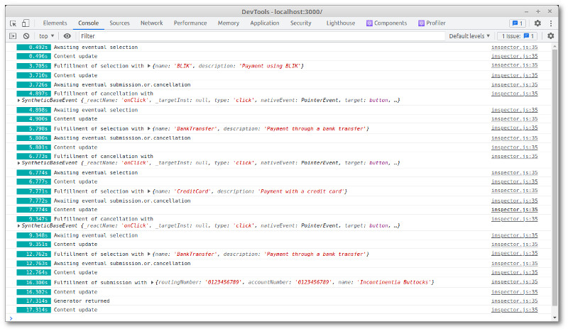

# Payment form example

This example demonstrates form handling using React-seq. It shows how using async generators makes dynamic
JS import easy and natural. It also showcases React-seq's event management system.

## Seeing the code in action

Go to the `examples/payment` folder. Run `npm install` then `npm start`. A browser window should automatically
open up.


## Payment page

```js
export function PaymentPage() {
  return useSequential(async function*({ fallback, manageEvents }) {
```

The [first line of the function](./src/PaymentPage.js#L5) is a call to
[`useSequential`](../../doc/useSequential.md#readme). The argument is an anonymous async generator function, which will yield
the contents of our component. Using object destructuring we obtain a pair of function from the hook: `fallback` and
`manageEvents`. The former is called immediately on the next line:

```js
  fallback(<PaymentLoading />);
```

This sets the fallback placeholder. A loading message will be on screen until our generator output the payment method
selection screen. For that to happen, we need to know what payment methods are available to the user. In real life,
that could depend on he where lives, what the product is, and other factors. We would need to contact the server
for this information. To do so, we dynamically load the module responsible for processing payment and call
`getPaymentMethods` to obtain the list of methods:

```js
  // load code related to making payments
  const { getPaymentMethods, processPayment } = await import('./payment.js');
  // get the available payment methods
  const methods = await getPaymentMethods();
```

We then preload the form used by each payment method so that when the user makes a selection, we can display the correct
form without delay:

```js
  // load input forms for the different methods
    const forms = {};
    for (const method of methods) {
      forms[method.name] = await import(`./PaymentMethod${method.name}.js`);
    }
```

Finally we load the selection screen itself:

```js
    const { default: PaymentSelectionScreen } = await import('./PaymentSelectionScreen.js');
```

Now we're ready to take down the fallback placeholder and show some real content:

```js
    const [ on, eventual ] = manageEvents();
    let success = false;
    let method = null;
    while (!success) {
      if (!method) {
        yield <PaymentSelectionScreen methods={methods} onSelect={on.selection} />;
        const { selection } = await eventual.selection;
        method = selection;
      }
```

Initially, we don't know what is the user's preferred payment method. So we show the selection screen. Later, if
for some reason we need to start over, we skip this step.

We use the `yield` operator to hand contents to React. Here we have a `<PaymentSelectionScreen />`. Its `onSelect` is
set to `on.selection`. Where is this `on.selection` coming from?

The two objects returned by `manageEvents` on [line 19](./src/PaymentPage.js#L19), `on` and `eventual`, are
[JavaScript proxy objects](https://developer.mozilla.org/en-US/docs/Web/JavaScript/Reference/Global_Objects/Proxy).
Their properties are dynamically generated. `eventual` automatically generates promises while `on` automatically
generates handlers that resolve these promises.

This bit of magic provided by the event manager is a key feature of React-seq. It allows you to use React in a 
more imperative fashion. Instead of passively reacting to events, you proactively seek out an answer. The 
prompt-and-wait-for-response logic you see above is reminiscent of console programs you might have  written in 
your first-year CS class:

```c
  int success = FALSE;
  int method = 0;
  while (!success) {
    if (!method) {
      printf("Select a payment method [1-%d]: ", method_count);
      scanf("%d\n", &method);
    }
```

This style of programming is easier to understand since it's closer to how we humans communicate. Debugging is easier
too, as the execution point doesn't jump all over the place.

The event manager let you await multiple promises at the same time. `await eventual.selection.or.cancellation` 
produces either `{ selection: [value] }` or `{ cancellation: [value] }.` `await eventual.selection.and.cancellation` 
produces `{ selection: [value], cancellation: [value] }` meanwhile. The fulfillment value is wrapped in an object 
even when you're awaiting a single promise. That's why in our example we have the following:

```js
      const { selection } = await eventual.selection;
      method = selection;
```

Alternatively, we could have used the following line instead:

```js
      method = await eventual.selection.value();
```

Now that the user has selected a method, we display the corresponding form, passing `on.submission`
as the `onSubmit` handler and `on.cancellation` as the `onCancel` handler:

```js
      const PaymentMethod = forms[method.name].default;
      yield <PaymentMethod onSubmit={on.submission} onCancel={on.cancellation} />;
      const { default: PaymentProcessingScreen } = await import('./PaymentProcessingScreen.js');
      // wait for user to submit the form or hit cancel button
      const { submission } = await eventual.submission.or.cancellation;
      if (!submission) {
        // go back to selection screen
        method = null;
        continue;
      }
```

If the user didn't hit the submit button, then obviously he hit the other, in which case we clear 
`method` and start the loop from the top again.

We load in the next screen while the user is busy filling the form. In theory, if he types really really 
fast, he could submit a response before we start waiting for it. There're ways we can fix this. Given how 
unlikely it is and how minor is the consequence, we'll just let it be.

Once we have the user response, we call a function to process the payment, putting up a new screen first:

```js
      yield <PaymentProcessingScreen method={method} />;
      try {
        const payment = await processPayment(method, submission);
        const { default: PaymentCompleteScreen } = await import('./PaymentCompleteScreen.js');
        yield <PaymentCompleteScreen payment={payment} />;
        success = true;
      } catch (err) {
        const { default: PaymentErrorScreen } = await import('./PaymentErrorScreen.js');
        yield <PaymentErrorScreen error={err} onRetry={on.retryRequest} />;
        await eventual.retryRequest;
      }
```

Since, this is just a demo the function doesn't do anything except randomly failing on occasions. If that happens we
load `PaymentErrorScreen` and wait for the user to click a button before starting the loop again. Otherwise we load
`PaymentCompleteScreen` and exit the loop.

## Logging

If you open the Development Console, you'll see various events that occur as you interact with the forms:



Logging is activated by the presence of an `InspectorContext`:

```js
export default function App() {
  const logger = useMemo(() => new ConsoleLogger(), []);
  return (
    <div className="App">
      <header className="App-header">
        <p>Payment Page Example</p>
      </header>
      <InspectorContext.Provider value={logger}>
        <PaymentPage />
      </InspectorContext.Provider>
    </div>
  );
}
```

React-seq's inspector interface is also used for unit testing.

## Unit testing

React-seq provides a basic mechanism for unit-testing components that uses its hooks:

```js
test('payment with BLIK', async () => {
  await withTestRenderer(<PaymentPage />, async ({ awaiting, showing, shown, resolve }) => {
    expect(showing()).toBe(PaymentSelectionScreen);
    expect(awaiting()).toBe('selection');
    await resolve({ selection: { name: 'BLIK', description: 'Payment using BLIK' } });
    expect(showing()).toBe(PaymentMethodBLIK);
    expect(awaiting()).toBe('submission.or.cancellation');
    await resolve({ submission: { number: '123 456' } });
    expect(shown()).toContain(PaymentProcessingScreen);
    expect(showing()).toBe(PaymentCompleteScreen);
    expect(awaiting()).toBe(undefined);
  });
});
```

`withTestRenderer` will render a component and wait for it to reach a stoppage point: an await on a promise
from the event manager or termination of the generator. After checking that it's awaiting what's expected and
showing what's expected, you can then force the component to go down a particular path by manually resolving
the awaited promise.

The test script above will fail half the time due to the random failure built into the example. A real test
script, with proper mocking, wouldn't have this kind of unpredictability.

## Final thoughts

In a typical web application (or any computer program, for that matter), we have code that reacts to user input
and code that acts on the user's behalf. React-seq basically lets you deal with this second part too within React. I
hope you find this approach useful. Thank you for your time. As always
[comments and suggestions](https://github.com/chung-leong/react-seq/discussions) are totally welcomed.
