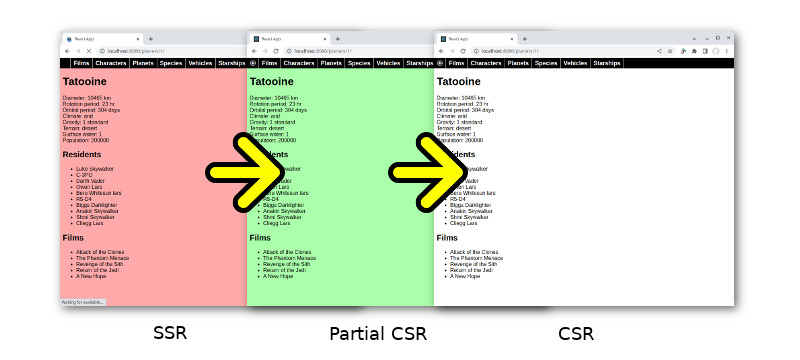

# Star Wars SSR example

In this example we're going to enhance the [Star Wars API example](../swapi/README.md) with server-side rendering
(SSR). As you will see, it does not require much effort.

## Seeing the code in action

Go to the `examples/swapi-ssr` folder. Run `npm install` and then `npm build`. Once the production build is
ready, run `npm start` to star the HTTP server. A browser window should automatically open up:



The Welcome page has no contents so the transition from SSR to CSR will happen in the blink of an eye. You will
need to navigate to a page with actual contents and do a reload to be able to notice its progress. Even
then you'll need to enable bandwidth throttling to get a realistic feel.

The server-side rendered contents has a reddish background. It's plain HTML. The CSS file has been loaded at
this point but not the JS file. When the JS bundle loads, our code will call
[`hydrateRoot`](https://reactjs.org/docs/react-dom-client.html#hydrateroot) and change the background to green.
At this point the page is partially client-side rendered. The top navigation bar is CSR now, but the main component
is still showing what came from the server. It has only just begun fetching data. It's basically at the stage where
the original example is showing a loading screen.

The page will become white when all page contents are CSR.

With the server still running, you can start the app in development server by running `npm run start-dev`. The
browser will take on the role of the server and generates the initial SSR contents.

## SSR in a nut shell

As implemented by React-seq, SSR is very much a low-hanging fruit affair. It's not at all sophisticated.
Basically we're just replacing an app's loading screen with a server-side generated snapshot of the app. It
like putting a photo of yourself in front of the camera in a Zoom meeting. People will think you're there
even though you're still in the shower. Since nothing gets discussed early on anyway, it doesn't really matter
that you aren't physically there.


Creating the impression that your website loads quickly is the key motivation of SSR. People dislike staring at
a spinner or a progress bar. In theory, adding a 10 second load time to an article that requires 10 minutes to
read should be immaterial. Of course, people don't think in such a way because we aren't completely rational
beings. Unless a site produces meaningful contents within seconds, visitors will bolt en masse.

## Server code

Enough discussion about human nature. Let us look at some code. For the purpose of this example, we're
using [`Fastify`](https://www.fastify.io/), a more modern alternative to [`Express`](https://expressjs.com/).
Our [HTTP server](./server/index.mjs) is initiated inside an IIAFE:

```js
(async () => {
  const fastify = Fastify({ ignoreTrailingSlash: true, trustProxy: true });
  // use automatic etag generation
  await fastify.register(Etag);
  // use cache control
  await fastify.register(Caching, { privacy: 'public', expiresIn: 300 });
  // use compression
  await fastify.register(Compression);
  // allow CORS
  await fastify.register(CORS, { origin: true });
  // handle static files
  await fastify.register(Static, { root: buildPath, serve: false });
```

The code above just sets up a bunch of middlewares. After that comes the routes. The first two routes are for
servicing data requests:

```js
  // register routes
  fastify.get('/api/:table', async (req, reply) => {
    const origin = `${req.protocol}://${req.hostname}`;
    const { table } = req.params;
    const page = parseInt(req.query.page) || 1;
    return loadTablePage(origin, table, page);
  });
  fastify.get('/api/:table/:id', async (req) => {
    const origin = `${req.protocol}://${req.hostname}`;
    const { table, id } = req.params;
    return loadTableObject(origin, table, id);
  })
```

Nothing interesting here. The functions involved just load data from different JSON files.

The [next route](./server/index.mjs#L37) is where the real action takes place:

```js
  fastify.get('/*', async (req, reply) => {
    const path = req.params['*'];
    if (path.includes('.')) {
      // it's a request for a static file at the root-level probably
      return reply.sendFile(path);
    } else {
      // render our app
      reply.type('text/html');
      const location = `${req.protocol}://${req.hostname}/${path}`;
      console.log(`Generating ${location}`);
      return renderInChildProc(location, buildPath);
    }
  });
```

When there's a dot in the path, we assume it's a request for a static file. Otherwise we assume it's a path in
our app. Regenerating the full URL, we pass it to [`renderInChildProc`](../../doc/client-side/renderInChildProc.md)
along with the path to our CRA production build. A child instance of Node.js then runs the exact same code that the
browser would.

That's it on the server side. The rendering of SSR contents actually happens in clinet-side code.

## Clint-side bootstrap

The [bootstrap code for the original example](../swapi/src/index.js) was basically the boilerplate from
[CRA](https://create-react-app.dev/):

```js
const root = ReactDOM.createRoot(document.getElementById('root'));
root.render(
  <React.StrictMode>
    <App />
  </React.StrictMode>
);
```

To enable SSR, we changed it to the following:

```js
const app = <StrictMode><App /></StrictMode>;
if (typeof(window) === 'object') {
  const container = document.getElementById('root');
  (async () => {
    if (process.env.NODE_ENV === 'development') {
      // do "SSR" on client side to make it easier to debug code during development
      await renderToInnerHTML(app, container);
    }
    const root = hydrateRoot(container, app);
    // indicate page is partially dynamic
    document.body.classList.add('csr-partial');
    await waitForHydration(root);
    // indicate page is fully dynamic now
    document.body.classList.add('csr');
    reportWebVitals();
  })();
} else {
  renderToServer(app);
}
```

We do a check for the presence of `window`. If it's there, the code is running in a browser. If not, the code is
running on the server. In the latter case, we simply call `renderToServer`, a helper function from `react-seq/client`.

On the browser side, we perform SSR *on the client side* during development to make debugging easier.
`renderToInnerHTML`, like `renderToServer`, calls `renderToReadableStream` from
[`react-dom/server`](https://reactjs.org/docs/react-dom-server.html) to render the app.

We call React-seq's version of `hydrateRoot` to hydrate the app. The function changes the `ssr` setting to 'hydrate'
prior to calling `react-dom/client`'s `hydrateRoot` and change it back to `false` when hydration completes.

If we strip out code that's there for debug or demo purpose, we'd have the following:

```js
const app = <StrictMode><App /></StrictMode>;
if (typeof(window) === 'object') {
  hydrateRoot(document.getElementById('root'), app);
  reportWebVitals();
} else {
  renderToServer(app);
}
```

Fairly simple. It's worth noting that `renderToServer` imports `react-dom/server` dynamically. Inclusion of SSR
rendering capability into the production build only increase the code size slightly when running on the browser.
(The same is true for `renderToInnerHTML` but then dead-code removal would have eliminated the call altogether
anyway.)

And that's it on the client side. The rest of the codebase is basically unchanged. A couple lines in
[`swapi.js`](./src/swapi.js) was changed to account for the fact that the app is now fetching data from the origin
server instead of [swapi.dev](https://swapi.dev/). And a few lines was added to [`Character.js`](./src/Character.js)
for demo purpose.

## Error reporting

React-seq will redirect console message from SSR to the client-side. You can see this in action by going to Species >
Gungan > Jar Jar Binks and reloading the page:


As you can see, React-seq will make use of source maps to give you the precise location in the original source file
when an error occurs.

## Server-side packages

The following npm packages are needed on the server side:

* [abort-controller](https://www.npmjs.com/package/abort-controller) - for polyfilling Node.js version 14 and below
* [node-fetch](https://www.npmjs.com/package/node-fetch) - for polyfilling Node.js version 16 and below
* [source-map](https://www.npmjs.com/package/source-map)

## Final thoughts

Enabling SSR is fairly easy when using React-seq. All you have to do is change a few lines and set up the server.
Of course, in order to get the most out of SSR you will need to carefully configure HTTP caching. Spawning an
instance of Node.js is a fairly expensive operation. You wouldn't want page generation to occur for every single
visitor to your website. Cache management is outside the scope of this example. Maybe in the future we'll deal
with the topic in another example.

Thank you for your time. Please make use of the [discussion board](https://github.com/chung-leong/react-seq/discussions)
if you have any question or suggestion.
