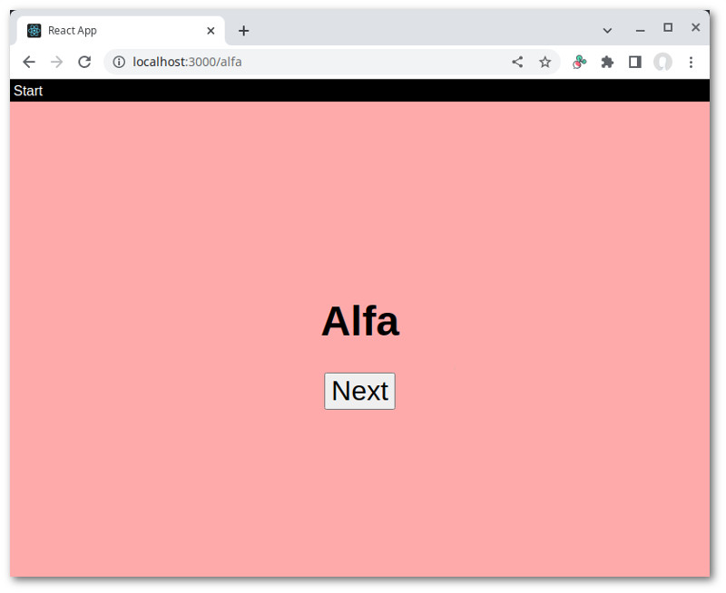

# Transition example

React-seq is useful for tasks that take time. A very good example is screen transition. By definition that always
occurs over time. Initially, only the old screen is shown. Then both the old screen and the new screen are partially
visible. Finally, only the new screen is shown.

This example will show you how natural it is to handle transition using async generators. It'll also
introduce you to the Yield-Await-Promise model of building a web application.

## Seeing the code in action

Go to the `examples/transition` folder. Run `npm install` then `npm start`. A browser window should automatically
open up.



## Crossfade operation

First, let us look at the transition code. We're not being overly ambitious here. The transition effect is going to
be relatively simple: a crossfade. The old screen will go from an opacity of 1 to 0, while the new screen will go
from an opacity of 0 to 1.

From inside a [`useSequential`](../../doc/useSequential.md) hook we can yield either a React element or an async
generator representing a sequence of React elements. That makes it every easy to add transition effects to an app.
We just need to go from this:

```js
  yield <ScreenAlfa />;
```

Which would cause `ScreenAlfa` to immediately replace what was there before, to this:

```js
  yield f(<ScreenAfla />);
```

Where `f` returns an async generator whose last item is `<ScreenAfla />`. Items coming before will be dictated by
the effect in question. In theory, they could be anything and in any number. For this example we'll stick with basic
CSS. Over the course of the transition, three things need to be rendered:

1. The old screen with opacity = 1 and the new screen with opacity = 0
2. The old screen with final opacity = 0 and the new screen with final opacity = 1
3. The new screen only

We'll need to keep track of the screen that's currently displayed. For that we use a class. Here's the constructor
of [Crossfade](./src/Crossfade.js):

```js
export class Crossfade {
  constructor(methods) {
    this.methods = methods;
    this.previous = null;
    this.previousKey = 0;
  }
```

A method named `to` is used to bring a new screen into view. For ergonomic reason we want the method
bound to the instance. Since there's no arrow function syntax for generator functions, we resort to the following
construct:

```js
  to = (async function *(element) {
    /* ... */
  }).bind(this);
```

We first save the provided element as the previous screen (for the next call):

```js
    const { previous, previousKey } = this;
    this.previous = element;
```

If there is a previous screen and it's of a different type, we output both it and the new screen in their initial
transition states ([.Crossfade .out](./src/css/Crossfade.css#10) and [.Crossfade .in](./src/css/Crossfade.css#19)):

```js
    let currentKey;
    if (!previous || isSameType(previous, element)) {
      currentKey = previousKey;
    } else {
      currentKey = ++this.previousKey;
      const { manageEvents } = this.methods;
      const [ on, eventual ] = manageEvents();
      yield (
        <div className="Crossfade">
          <div key={previousKey} className="out">{previous}</div>
          <div key={currentKey} className="in">{element}</div>
        </div>
      );
      await eventual.transitionReady.for(25).milliseconds;
```

We then wait 25 milliseconds to ensure that the DOM nodes are ready. There's probably a better way to do
this. Using a timer happens to easy and reliable. I'm open to suggestion.

After this brief pause we add "end" to the class names of the two div's:

```js
      yield (
        <div className="Crossfade">
          <div key={previousKey} className="out end" onTransitionEnd={on.transitionOut}>{previous}</div>
          <div key={currentKey} className="in end" onTransitionEnd={on.transitionIn}>{element}</div>
        </div>
      );
      await eventual.transitionIn.and.transitionOut;
    } // end of if (previous)
```

That sets the transition into motion. This time we actually have an event we can await:
[transitionend](https://developer.mozilla.org/en-US/docs/Web/API/Element/transitionend_event). When both transitions
are done we proceed to the final step, namely rendering only the new screen:

```js
    yield (
      <div className="Crossfade">
        <div key={currentKey}>{element}</div>
      </div>
    );
  }).bind(this);
```

This is what would happen immediately when there is no previous screen or it's the same type as the upcoming one.

`Crossfade` provides a second method that prevents a transition from occurring. The logic is pretty simple:

```js
  prevent = () => {
    this.previous = null;
    this.key--;
  }
```

Now let us examine how our Crossfade class is put to use.

## App component

The example app uses [Array-router](https://github.com/chung-leong/array-router/README.md), a minimalist library also
used in the other examples. The specialized hook
[`useSequentialRouter`](https://github.com/chung-leong/array-router/blob/main/doc/useSequentialRouter.md)
is used here. It differs from [`useRouter`](https://github.com/chung-leong/array-router/blob/main/doc/useRouter.md) in
that it does not trigger component updates when the route changes. It also offers more flexibility on how its context
provider and error boundary are created.

After creating the router, we call [`useSequential`](../../doc/useSequential.md). Instead of an async generator
function, we use an async function that will return an async generator:

```js
export function App({ main }) {
  const [ ready, setReady ] = useState(false);
  const [ parts, query, rMethods, { createContext, createBoundary } ] = useSequentialRouter();
  return createContext(useSequential(async (sMethods) => {
    const methods = { ...rMethods, ...sMethods };
    const { fallback, reject, mount, wrap, trap } = methods;
```

We use [`fallback`](../../doc/fallback.md) to provide a fallback element:

```js
    fallback(<ScreenLoading />);
```

We use [`wrap`](../../doc/wrap.md) to place the router's error boundary around contents from the generator:

```js
    wrap(children => createBoundary(children));
```

The error boundary needs to be inside the element created by `useSequential`. If it were outside, then the element
would get unmounted by React when an error occurs, causing the generator to be shut down.

We then wait for the component to mount, then use the router's
[`trap`](https://github.com/chung-leong/array-router/blob/main/doc/trap.md) function to capture errors caught at its
error boundary. We use [`reject`](../../doc/reject.md) to redirect the error to the active `await` statement:

```js
    await mount();
    trap('error', (err) => {
      reject(err);
      return false;
    });
```

We use `trap` again to capture "detour" events. A detour is either the use of the browser's back/forward buttons or
a click on a link. It's an error object that we also redirect to the active `await` statement using `reject`:

```js
    trap('detour', (err) => {
      reject(err);
      return true;
    });
```

The following function is used to manipulate the route:

```js
    methods.manageRoute = (def) => {
      const proxy = arrayProxy(parts, def);
      return [ proxy, query ];
    };
```

And here's where we create our `Crossfade` object:

```js
    methods.transition = new Crossfade(methods);
```

Finally, we load the `main` function from a file and invoke it, giving it a state object and a bundle of methods:

```js
    const { default: main } = await import('./main.js');
    return main({}, methods);
  }, [ parts, query, rMethods, createBoundary ]));
}
```

And that's it. The idea here is that `App` provides the basic plumbing, while the "real" actions take place inside
`main`. Let us look at what this function does:

## The main function

The [function](./src/main.js) begins by setting up some variables:

```js
export async function* main(state, methods) {
  const { manageRoute, manageEvents, transition, wrap, throw404, isDetour } = methods;
  const [ route ] = manageRoute({ screen: 0 });
  const [ on, eventual ] = manageEvents();
  const { to } = transition;
```

`manageEvents` and `wrap` come from `useSequential`, while `throw404` and `isDetour` are provided by the router.

`manageRoute` returns a [proxy object](https://github.com/chung-leong/array-router/blob/main/doc/arrayProxy.md), whose
`screen` property is mapped to the first part of the path. When the path is "/alfa", `route.screen` will be "alfa".

The function then enters an endless loop holding a [try-catch block](./src/main.js#L14):

```js
  for (;;) {
    try {
```

The [catch block](./src/main.js#L82) handles
[detour requests](https://github.com/chung-leong/array-router/blob/main/doc/RouteChangePending.md) (always approving
them) and shows an error screen for other error types:

```js
    } catch (err) {
      if (isDetour(err)) {
        await err.proceed();
      } else {
        yield <ScreenError error={err} onRetry={on.retryRequest} />;
        await eventual.retryRequest;
      }
    }
  }
}
```

Within the try block, our code checks what's in `route.screen`. Initially, the [following](./src/main.js#L16)
will match:

```js
      if (route.screen === undefined) {
        const { default: ScreenStart } = await import('./screens/ScreenStart.js');
        yield to(<ScreenStart onNext={on.alfa} />);
        await eventual.alfa;
        route.screen = 'alfa';
      } else ...
```

[`ScreenStart`](./src/ScreenStart.js) is dynamically loaded. We then use `to` in `CrossFade` to transition to it.
Since there is no previous screen, `to` will yield the element and immediately return. We then begin awaiting the
promise `eventual.alfa`. It is fulfilled when `on.alfa` is called.

That's the basics of the Yield-Await-Promise model. We yield a visual element that prompts the user to do
something then wait for him to do so. It's that simple. The model is reminiscent of the sort of simply text
programs that you might have written in your first-year CS class. Instead of a text prompt sent to the
terminal, here we're outputting an HTML component, through React, to the web browser.

When you click the button on the page, `route.screen` gets set to "alfa". This changes the location from
"http://localhost:3000/" to "http://localhost:3000/alfa", sending us to the [next clause](./src/main.js#L21):

```js
      } else if (route.screen === 'alfa') {
        const { default: ScreenAlfa } = await import('./screens/ScreenAlfa.js');
        yield to(<ScreenAlfa onNext={on.bravo} />);
        await eventual.bravo;
        route.screen = 'bravo';
      } else ...
```

The code is essentially identical to the section above. A transition will actually happen this time.

If you hit the browser's back button, `await eventual.bravo` will throw with a `RouteChangePending` error. This lands
in the catch block, which tells the router to proceed with the change. `route.screen` becomes `undefined` and
matches the first `if` clause once again.

If you click the button on the page instead, the promise is fulfilled and `route.screen` is set to "bravo". We
end up in the [next clause](./src/main.js#L26):

```js
      } else if (route.screen === 'bravo') {
        const { default: ScreenBravo } = await import('./screens/ScreenBravo.js');
        yield to(<ScreenBravo onNext={on.charlie} onSkip={on.delta} />);
        const res = await eventual.charlie.or.delta;
        if ('charlie' in res) {
          route.screen = 'charlie';
        } else if ('delta' in res) {
          route.screen = 'delta';
        }
      } else ...
```

This screen has two buttons. We have to await two promises: `charlie` or `delta`. The fulfillment value will
be either `{ charlie: ... }` or `{ delta: ... }`. If it's the former, we go to the Charlie clause:

```js
      } else if (route.screen === 'charlie') {
        const { default: ScreenCharlie, ThirdTimeNotTheCharm } = await import('./screens/ScreenCharlie.js');
        try {
          state.count ??= 1;
          yield to(<ScreenCharlie count={state.count++} onNext={on.delta} />);
          await eventual.delta;
          route.screen = 'delta';
        } catch (err) {
          if (err instanceof ThirdTimeNotTheCharm) {
            continue;
          } else {
            throw err;
          }
        }
      } else ...
```

There's a try-catch block in this clause, as [`ScreenCharlie`](./src/ScreenCharlie.js) will throw when a
number divisible by three is given to it:

```js
export function ScreenCharlie({ count, onNext }) {
  if (count % 3 === 0) {
    throw new ThirdTimeNotTheCharm(`Thou shalst not count to ${count}`);
  }
```

When that happens, we simply continue on, since the count has already been incremented and it'll be safe to
render the component again.

The `if` clause for [`ScreenDelta`](./src/ScreenDelta.js) also has a try-catch block:

```js
      } else if (route.screen === 'delta') {
        const { default: ScreenDelta } = await import('./screens/ScreenDelta.js');
        try {
          state.text ??= '';
          yield to(<ScreenDelta text={state.text} onText={t => state.text = t} onNext={on.echo} />);
          await eventual.echo;
          route.screen = 'echo';
        } catch (err) {
          if (isDetour(err) && state.text.trim().length > 0) {
            yield to(<ScreenDelta text={state.text} onDetour={on.proceed} />);
            const { proceed } = await eventual.proceed;
            if (proceed) {
              throw err;
            } else {
              err.prevent();
            }
          } else {
            throw err;
          }
        }
      } else ...
```

This time we're catching the `RouteChangePending` error. When it occurs, we ask `ScreenDelta` to put up a
dialog box by giving it a `onDetour` handler. We expect it to be called with either `true` or `false`. In the
first case, we rethrow the error so the outer catch block will approve the detour. Otherwise the detour is
prevented and we land back in `ScreenDelta`.

The next section, Echo, loads and calls a function:

```js
      } else if (route.screen === 'echo') {
        const { default: echo } = await import('./echo.js');
        state.echo ??= {};
        yield echo(state.echo, methods);
        route.screen = 'foxtrot';
      } else ...
```

Like `main`, `echo` is an async generator function. Execution of `main` will pause until all items have been retrieved
from the new generator.

The final section just send us back to section Alfa:

```js
      } else if (route.screen === 'foxtrot') {
        const { default: ScreenFoxtrot } = await import('./screens/ScreenFoxtrot.js');
        yield to(<ScreenFoxtrot onNext={on.alfa} />);
        await eventual.alfa;
        route.screen = 'alfa';
      } else ...
```

If nothing matches, a 404 error is thrown:

```js
      } else {
        throw404();
      }
```

## The echo function

`echo` has the same structure as `main`:

```js
export async function* echo(state, methods) {
  const { manageRoute, manageEvents, throw404, transition, replacing } = methods;
  const [ route ] = manageRoute({ screen: 1 });
  const [ on, eventual ] = manageEvents();
  const { to } = transition;
  for (;;) {
    try {
      if (route.screen === undefined) {
        replacing(() => route.screen = '1');
      } else if (route.screen === '1') {
        const { default: ScreenEcho1 } = await import('./screens/ScreenEcho1.js');
        yield to(<ScreenEcho1 onNext={on.next} />);
        await eventual.next;
        route.screen = '2';
      } else if (route.screen === '2') {
        /* code omitted */
      } else if (route.screen === '3') {
        /* code omitted */
      } else if (route.screen === '4') {
        const { default: ScreenEcho4 } = await import('./screens/ScreenEcho4.js');
        yield to(<ScreenEcho4 onNext={on.next} />);
        await eventual.next;
        delete route.screen;
        return;
      } else {
        throw404();
      }
    } catch (err) {
      throw err;
    }
  }
}
```

The only difference is that this function returns and it does not handle errors. Any error would pop through and
land in the catch block of `main`.

## Error handling

Let us return to the Charlie clause and consider how an error emitted by `ScreenCharlie` would land in that
clause's catch block. Here's the code once again:

```js
      } else if (route.screen === 'charlie') {
        const { default: ScreenCharlie, ThirdTimeNotTheCharm } = await import('./screens/ScreenCharlie.js');
        try {
          state.count ??= 1;
          yield to(<ScreenCharlie count={state.count++} onNext={on.delta} />);
          await eventual.delta;
          route.screen = 'delta';
        } catch (err) {
          if (err instanceof ThirdTimeNotTheCharm) {
            continue;
          } else {
            throw err;
          }
        }
      } else ...
```

`ScreenCharlie` isn't actually called in the try block, either directly or indirectly. How does
an error emitted by the function get there then?

`ScreenCharlie` is passed to React, which calls it when it renders the component. React will catch any error thrown
and search for the nearest error boundary moving up the component tree. Now as you may recall, our router
provides one in [App](./src/App.js#12):

```js
    wrap(children => createBoundary(children));
```

This boundary hands the error to the router, which in turns gives it to the
[trap function we provided](./src/App.js#14):

```js
      trap('error', (err) => {
        reject(err);
        return false;
      });
```

`reject` causes the current await operation to rethrow the error. What and where is this operation? Well,
React would encounter the error as soon as its tries to render `ScreenCharlie`. This happens in
[Crossfade.js](./src/Crossfade.js#L21):

```js
      yield (
        <div className="Crossfade">
          <div key={previousKey} className="out">{previous}</div>
          <div key={currentKey} className="in">{element}</div>    // <--- ScreenCharlie
        </div>
      );
```

The await statement immediately below is where the error gets rethrown:

```js
      await eventual.transitionReady.for(25).milliseconds;
```

Since `Crossfade.to` doesn't do a try-catch, the error will pop through (and shuts down) the generator.
React-seq will catch this error and redirect it to the parent generator using
[AsyncGenerator.throw](https://developer.mozilla.org/en-US/docs/Web/JavaScript/Reference/Global_Objects/AsyncGenerator/throw). It does the following (from Mozilla):

> The throw() method of an async generator acts as if a throw statement is inserted in the generator's body at
> the current suspended position, which informs the generator of an error condition and allows it to handle the
> error, or perform cleanup and close itself.

The "current suspended position" of `main` at this point would be between the [following two lines](./src/main.js#L39):

```js
          yield to(<ScreenCharlie count={state.count++} onNext={on.delta} />);
          await eventual.delta;
```

And that's how the error magically ends up inside the try block.

Whowee! That error sure went on one heck of a trip! You don't need to fully understand how this all works.
Just remember that there's a mechanism in place that allows you to handle errors where doing so makes intuitive
sense.

Before we leave the topic of error handling, let us consider the scenario where we aren't doing transition.
Our Charlie clause would look like this:

```js
      } else if (route.screen === 'charlie') {
        const { default: ScreenCharlie, ThirdTimeNotTheCharm } = await import('./screens/ScreenCharlie.js');
        try {
          yield <ScreenCharlie count={state.count++} onNext={on.delta} />;
          await eventual.delta;
          route.screen = 'delta';
        } catch (err) {
          if (err instanceof ThirdTimeNotTheCharm) {
            continue;
          } else {
            throw err;
          }
        }
      } else ...
```

The code is identical except there's no `to(...)` after `yield`. What happens in this case? Exactly the same outcome,
with error thrown by `await eventual.delta` instead.

## Going out with a bang

Now for something fun. In [Explosion.js](./src/Explosion.js), you'll find code for an explosive transition effect.
To see it in action, simply replace all occurences of "Crossfade" with "Explosion" in [App.js](./src/App.js).

It probably doesn't work in Safari, but then again who does?

## Final thoughts

Thank you for reading! I hope the code was largely self-explanatory. It should be since it's all standard JavaScript:
a lot of ifs, yields, and awaits. One of the main goals of React-seq is to let programmers leverage language
features more effectively, features related to the async model in particular.

As said elsewhere, async generators aren't just dynamically generated arrays. You should think of them as timelines,
sequences of events. In this example, the sequences are fairly simple: just transitions from screen to screen.
Potentially much more complex sequences can be constructed, complete with server and user interactions. And thanks to
Rect-seq ability to handle nested generators, they would only be a function call away. I will explore the
possibilities further in the future as ideas come to me. If you have some ideas of your own, please feel free to
share them in the [dicussion board](https://github.com/chung-leong/react-seq/discussions).
