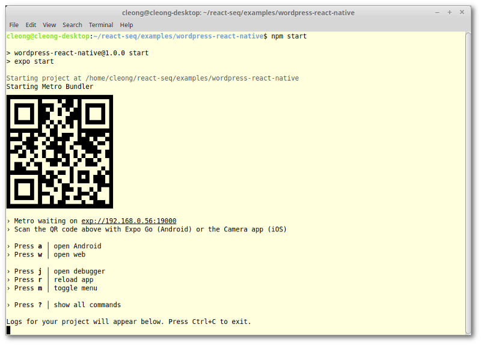
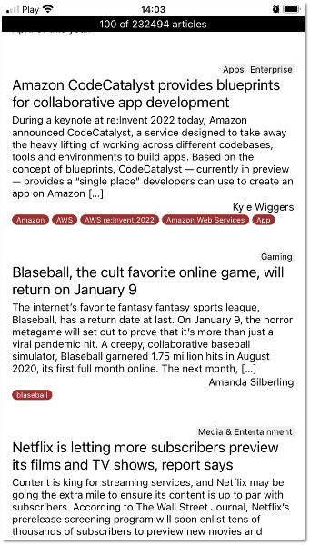

# WordPress React Native example

In this example, we're going to create a simple [React Native](https://reactnative.dev/) based on the earlier
[WordPress example](../wordpress/README.md). The main motivation is to show that React-seq works on that platform.

Disclaimer: I'm a novice at React Native. The code shown here might not conform to best practices. If you see any
shortcoming, please leave a comment in on the [discussion board](https://github.com/chung-leong/react-seq/discussions).

I've also only tested it on an iPhone. If you're an owner of an Android phone, I'd really like to hear about your
experience.

## Seeing the code in action

To run the example, you'll need to install [Expo Go](https://expo.dev/client) on your mobile device.

Go to the `examples/wordpress` folder. Run `npm install` then `npm start`. A QR-Code will appear on screen:



If you have an iPhone, scan the QR-code using the Camera app and follow the link. If you have an Android phone, scan
the code using Expo GO.

The example app should appear after some time:



## Article list, the asynchronous part

```js
export default function ArticleList() {
  const wp = useWordPressPosts();
  return useProgressive(async ({ fallback, type, defer, usable, manageEvents, signal }) => {
    type(ArticleListUI);
    fallback(<ArticleLoading />);
    defer(200);
    usable(0);
    usable({ articles: 1, categories: 1 });
    const [ on, eventual ] = manageEvents();
    const {
      fetchAll,
      fetchAuthors,
      fetchCategories,
      fetchTags,
    } = wp;
    const options = { signal };
    const articles = fetchAll(() => eventual.needForMore, options);
    const authors = fetchAuthors(articles, options);
    const categories = fetchCategories(articles, options);
    const tags = fetchTags(articles, options);
    return { articles, authors, categories, tags, onBottomReached: on.needForMore };
  }, [ wp ]);
}
```

## Article list, the synchronous part

```js
function ArticleListUI({ articles = [], authors = [], categories = [], tags = [], onBottomReached }) {
  const { length, total } = articles;
  const listProps = {
    data: articles,
    styles: styles.articleList,
    onEndReached: onBottomReached,
    onEndReachedThreshold: 2,
    renderItem: ({ item: article }) => {
      const props = {
        key: article.id,
        article,
        authors: authors.filter(a => article.authors.includes(a.id)),
        categories: categories.filter(c => article.categories.includes(c.id)),
        tags: tags.filter(t => article.tags.includes(t.id)),
      };
      return <ArticleUI {...props} />;
    },
  };
  return (
    <SafeAreaView style={styles.container}>
      <Text style={styles.topBar}>{length} of {total} articles</Text>
      <FlatList {...listProps} />
    </SafeAreaView>
  );
}
```

## Article control

```js
function ArticleUI({ article, authors, categories, tags }) {
  const onTitlePress = () => Linking.openURL(article.link);
  return (
    <View style={styles.article}>
      <View style={styles.categories}>
        {categories.map(c => <Content key={c.id} style={styles.category} value={c.name} />)}
      </View>
      <TouchableHighlight underlayColor="#DDDDDD" onPress={onTitlePress}>
        <Content style={styles.title} value={article.title} />
      </TouchableHighlight>
      <Content style={styles.excerpt} value={article.excerpt} />
      <View style={styles.authors}>
        {authors.map(a => <Content key={a.id} style={styles.author} value={a.name} />)}
      </View>
      <View style={styles.tags}>
        {tags.map(t =>
          <View key={t.id} style={styles.tag}>
            <Content style={styles.tagLabel} value={t.name} />
          </View>
        )}
      </View>
    </View>
  );
}
```
