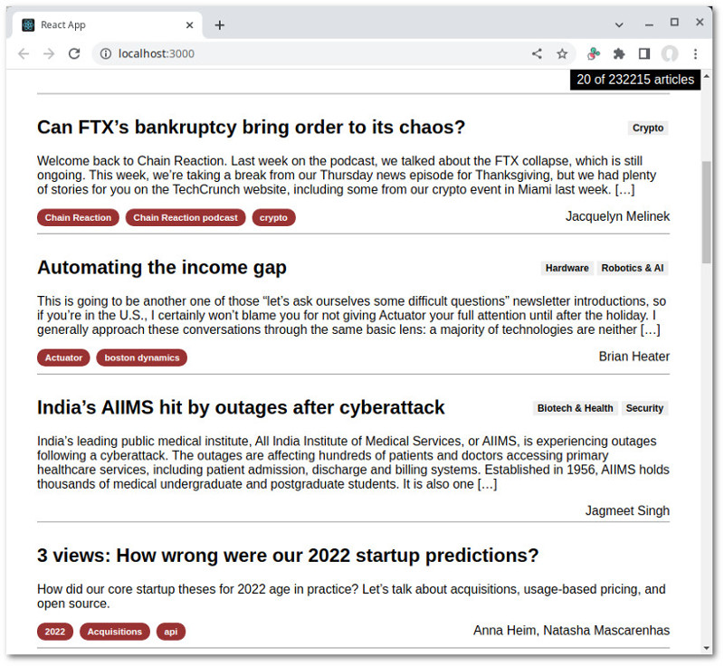

# WordPress Example

In this example, we're going to build past that displays WordPress articles with infinite scrolling. For this purpose,
we're going to employ the [`useProgress`](../../doc/useProgressive.md) hook. It's a specialized hook designed for
loading data into a component. It acts sort of as a translator of data from the async world, turning promises into
objects and async generators into arrays.

[Tech Crunch](https://techcrunch.com/) will serve as the data source for our example. The site has hundreds of
thousands of articles. Even the most determined scroller will not manage to reach the end.

## Seeing the code in action

Go to the `examples/wordpress` folder. Run `npm install` then `npm start`. A browser window should automatically
open up.



## Article list, the synchronous part

First, let us look at [the data recipient](./src/ArticleList.js#L33), a regular React component that expects five
arrays and one handler as props:

```js
function ArticleListUI({ articles = [], authors = [], categories = [], tags = [], media = [], onBottomReached }) {
  const bottom = useRef();
  useEffect(() => {
    const observer = new IntersectionObserver(onBottomReached, {
      rootMargin: '0px 0px 1000px 0px',
      threshold: 0
    });
    observer.observe(bottom.current);
    return () => {
      observer.disconnect();
    };
  }, [ onBottomReached ]);
  const { length, total } = articles;
  return (
    <ul className="ArticleList">
      <div className="count">{length} of {total} articles</div>
      {articles.map((article) => {
        const props = {
          key: article.id,
          article,
          authors: authors.filter(a => article.authors.includes(a.id)),
          categories: categories.filter(c => article.categories.includes(c.id)),
          tags: tags.filter(t => article.tags.includes(t.id)),
          media: article.featured && media.find(m => article.featured_media === m.id),
        }
        return <ArticleUI {...props} />
      })}
      <div ref={bottom} className="bottom"></div>
    </ul>
  );
}
```

Using a useEffect hook, we attach an
[IntersectionObserver](https://developer.mozilla.org/en-US/docs/Web/API/Intersection_Observer_API) to a div that we
draw at the bottom of the page. Whenever this div gets within 1000 pixels of the viewport, `onBottomReached` is called
to trigger the loading of additional contents.

The rest of the code is pretty React. For each article we obtain its authors, its categories, and so forth from the
respected arrays. There's no guarantee the objects will be there. The component `ArticleUI` is expected to deal with
the absence of data.

Note the use of `articles.total`. This is the total number of articles available, as reported by WordPress. You'll
see later how this number gets attached to the array.

## Article list, the asynchronous part

Now it's time to examine [the component that supplies the data](./src/ArticeList.js#L6):

```js
export default function ArticleList() {
  const wp = useWordPressPosts();
  return useProgressive(async ({ fallback, type, usable, manageEvents, signal }) => {
    fallback(<div className="loading">Loading...</div>)
    type(ArticleListUI);
    usable(0);
    usable({ articles: 1 });
    const [ on, eventual ] = manageEvents();
    const {
      fetchAll,
      fetchAuthors,
      fetchCategories,
      fetchTags,
      fetchFeaturedMedia,
    } = wp;
    const options = { signal };
    const articles = fetchAll(() => eventual.needForMore, options);
    const authors = fetchAuthors(articles, options);
    const categories = fetchCategories(articles, options);
    const tags = fetchTags(articles, options);
    const media = fetchFeaturedMedia(articles, options);
    return { articles, authors, categories, tags, media, onBottomReached: on.needForMore };
  }, [ wp ]);
}
```

First, it calls `useWordPressPosts` to obtain a set of data retrieval functions. It then calls `useProgressive` with
an anonymous async function. This function is expected to set up the generators to be used and configure the operation.
It gets a number of config functions from React-seq by the way of destructuring. We use `fallback` to set a placeholder.
We use `type` to indicate the target component. We call `usable` once to tell `useProgressive` that all props should
be considered usable even when empty, then a second time, to put a minimum on `articles`. We want to have at least one
article before we take down the fallback placeholder.

We call `manageEvents` to gain event management functionalities. There's just one event to manage: `needForMore`. The
promise of such an event is passed to `fetchAll` via an arrow function. When it is fulfilled, `fetchAll` knows a need
for more data has arisen and will respond accordingly. This happens when the bottom of the list is reached.

## Fetch functions

Let's now look at [the fetch functions](./src/wordpress.js#L101):

```js
  function fetchAll(demand, options) {
    return fetchObjectsContinual('wp/v2/posts', demand, options);
  }

  function fetchAuthors(generator, options) {
    return fetchObjectComponents('wp/v2/users', 'authors', generator, options);
  }

  function fetchCategories(generator, options) {
    return fetchObjectComponents('wp/v2/categories', 'categories', generator, options);
  }

  function fetchTags(generator, options) {
    return fetchObjectComponents('wp/v2/tags', 'tags', generator, options);
  }

  function fetchFeaturedMedia(generator, options)  {
    const mediaId = p => p.featured ? [ p.featured_media ] : [];
    return fetchObjectComponents('wp/v2/media', mediaId, generator, options);
  }
```

As you can see, they each just call a helper function with the path to the corresponding data. `fetchObjectComponents`
is also given the location of the ids within the source object. Note it accepts a generator as an argument. We'll
come back to this. First we'll tackle [`fetchObjectsContinual`](./src/wordpress.js#L12), the function we use to
retrieve articles.

```js
  function fetchObjectsContinual(path, demand, options) {
    async function* generate() {
      let page = 0;
      for (;;) {
        const list = await fetchObjectsByPage(path, ++page, options);
        const pageCount = list.pages;
        generator.total = list.total;
        yield list.values();
        if (page >= pageCount) {
          break;
        }
        await demand();
      }
    }
    const generator = generate();
    return generator;
  }
```

We use an inner function here to create the generator, so that we can attach a property to it. This function runs an
infinite loop, fetching one page of data (10 articles) in each iteration. We expect from `fetchObjectsByPage` an array
with two additional properties `pages` and `total`. These two numbers are extracted from the HTTP response object.

```js
    array.total = parseInt(res.headers.get('X-WP-Total'));
    array.pages = parseInt(res.headers.get('X-WP-TotalPages'));
```

`useProgressive` will transfer all enumerable properties from the generator to the destination array. Assigning to
`generator.total` means the value showing up as `articles.total` in `ArticleListUI`.

Instead of yielding the array, the generator yields an iterator of it. This signals to `useProgressive` that the
arrays should be concatenated together. Without the call to `values` we would end up with an array of arrays instead.

After doing that it calls `demand` and waits for it to return, meaning it'll wait for the fulfillment of
`eventual.needForMore` from `ArticleLIst`.

Okay, I hope that wasn't hard to understand. Time to examine the other function, `fetchObjectComponents`. We use it to
obtain records related to the articles we've retrieved like tags and authors. Here's where we run into a bit of a
dilemma. The function doesn't actually get a list of articles, it gets a generator producing article objects. This is
problematic since we can only iterate through a generator once. A second iteration would yield nothing. How can our
function access the articles without disrupting others that also need to do the same?

The solution is the [stasi function](../../doc/stasi.js). It creates generators that spy on other generators,
replicating what they produce. This allows multiple functions to access the output from the same generator.
Calling it is the first thing that we do:

```js
  function fetchObjectComponents(path, field, generator, options) {
    generator = stasi(generator);
    async function *generate() {
      const fetched = {};
      for await (const objects of generator) {
        const fetching = [];
        for (const object of objects) {
          const ids = typeof(field) === 'function' ? field(object) : object[field];
          // see which ones haven't been fetched yet
          for (const id of ids) {
            if (!fetched[id]) {
              fetching.push(id);
              fetched[id] = true;
            }
          }
        }
        if (fetching.length > 0) {
          // some are still missing
          const components = await fetchObjectsByIds(path, fetching, options);
          yield components.values();
        }
      }
    }
    return generate();
  }
```

The generator function iterates through the generator it's been given, receiving each time an synchronous
iterator. It iterates through that, extracting the ids of the related objects in accordance to `field`. It checks
to see which ones haven't yet been fetched and fetch them, yielding finally as before, an array iterator.

Explaining why here too we're creating the generator with an inner function is a bit trickier. We have to digress
for a moment and look at the subtle difference of generator functions from normal functions.

## Generator functions vs normal functions

Generator functions (async or otherwise) aren't just function that return generators. They behave differently in one
subtle but critical way. When we call a generator function, nothing happens immediately. The generator just gets
created. The first line of the function gets executed when we retrieve the first item from the generator.

The following snippet demonstrates the behavior:

```js
// async generator function
async function* functionA() {
  console.log('first line');
  yield 'Hello world';
}

// function returning an async generator
function functionB() {
  console.log('first line');
  async function* generate() {
    yield 'Hello world';
  }
  return generate();
}

(async () => {
  const a = functionA();
  console.log('functionA() called');
  for await (const line of a) {}
  console.log('-'.repeat(20));
  const b = functionB();
  console.log('functionB() called');
  for await (const line of b) {}
})();
```

Result:
```
functionA() called
first line
--------------------
first line
functionB() called
```

Had we declare `fetchObjectComponents` itself an async generator function, like so:

```js
  async function *fetchObjectComponents(path, field, generator, options) {
    generator = stasi(generator);
    const fetched = {};
    for await (const objects of generator) {
      /* ... */
    }
  }
```

It would not work correctly, as some items could have been extracted from the target generator before `stasi` gets
a hand on it. We can't allow that. We want to give `stasi` the chance to install its apparatus as soon as possible.
That's why we call it in a regular function and use an inner function to create the generator.

This subtle behavioral difference is something you need to keep in mind when working with generators. Otherwise
you'll go insane debugging.
